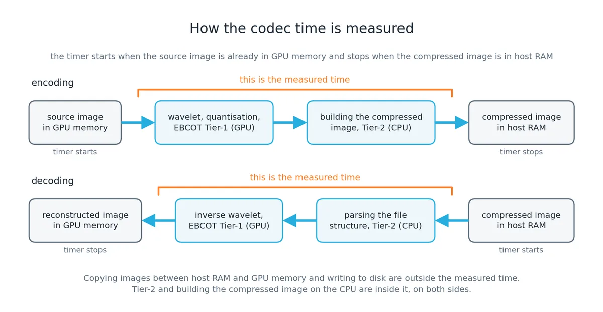
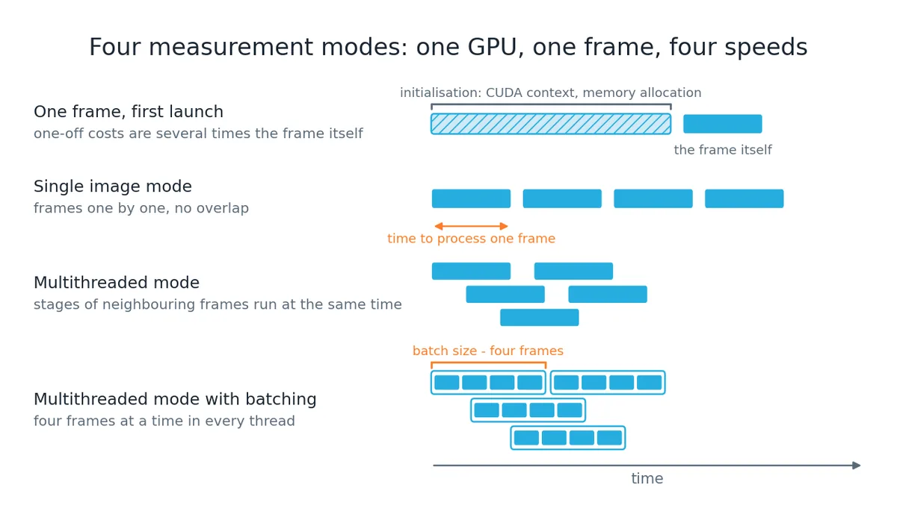
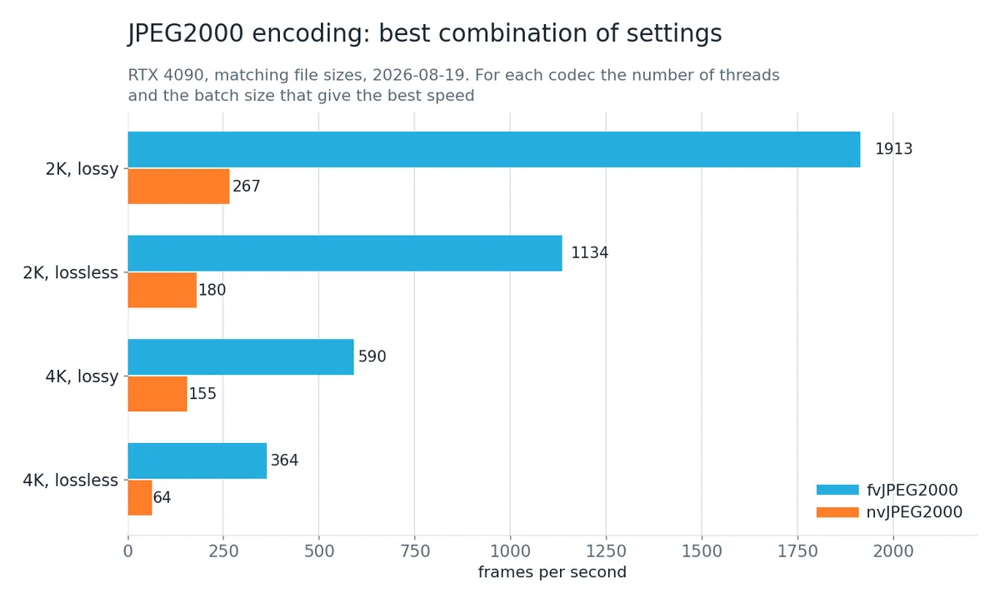
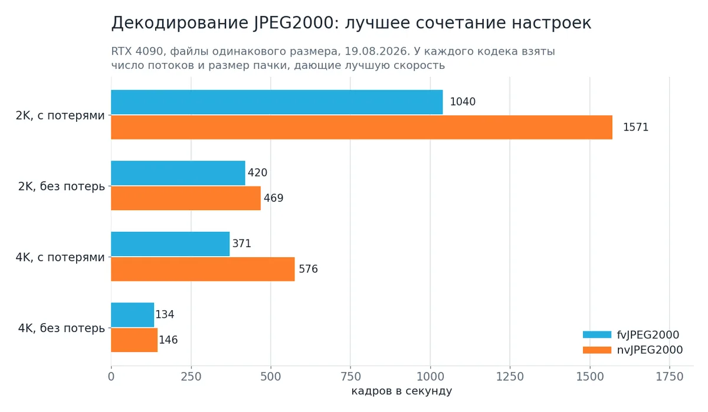

# JPEG2000 on GPU: the codec from Fastvideo SDK and the nvJPEG2000 library

Measurement run of 19 August 2026 on an NVIDIA GeForce RTX 4090. The data behind this text is in [`results/2026-08-19/`](../../results/2026-08-19/): tables, machine-readable results and the raw logs of every launch.

The original of this article is published at [www.fastvideo.ru/blog/jpeg2000-benchmarks.htm](https://www.fastvideo.ru/blog/jpeg2000-benchmarks.htm). This copy is a snapshot: it is fixed to the run above and is not updated when the article changes.

Text of the article: CC BY-ND 4.0. Measurement data and tables: CC BY 4.0. See `LICENSE-CONTENT.md` in the root of the repository.

*The timer starts when the source image is already in GPU memory and stops when the compressed image is in host RAM. Tier-2 and building the compressed image on the CPU are inside the measured time on both sides.*

## 1. What is compared and why

There are currently several JPEG2000 codec implementations for the GPU, both
commercial and open source. This article compares the two codecs an engineer
most often has to choose between.

The first codec comes from the **nvJPEG2000** library by NVIDIA. The library
is free, but it ships separately from the CUDA Toolkit: it can be downloaded
from the NVIDIA site or installed from a Python package. Further in the text
this codec is called by its full name; in tables it is shortened to **NV**.

The second one is the [JPEG2000 codec](https://www.fastvideo.ru/products/cuda-jpeg2000-codec.htm) by
**Fastvideo**, further **fvJPEG2000**, in tables **FV**. It ships as part of
the [Fastvideo SDK](https://www.fastvideo.ru/products/fastvideo-sdk.htm) and is licensed on a
commercial basis.

**Why exactly these two codecs?** There are others. Kakadu is a commercial
JPEG2000 library from the Australian company Kakadu Software; Comprimato is a
commercial GPU JPEG2000 codec from the company of the same name. Neither of
them was tested here: we did not ask their developers for permission and we do
not undertake to interpret their license terms on their behalf. The
performance measurement procedure is published in full — anyone who holds a
license for these products can run the same tests and publish their own
results.

There is also the open implementation OpenJPEG, but it runs on the CPU, and
the performance gap against a GPU is very large. That codec makes sense to
test separately.

Any engineer's first question is simple: why pay if NVIDIA already has a free
solution? An answer to such a question is not given by pictures and promises —
it needs performance measurements that the reader can repeat locally, on their
own GPU and their own images. This article is about how to organize such
measurements, and what came out when we ran them.

A caveat, without which there is no point in reading further: **we do not
consider NVIDIA a competitor.** fvJPEG2000 is written in CUDA — the same
NVIDIA library — and runs on NVIDIA GPUs. This is a comparative analysis, not
an argument: an engineering measurement of two different implementations of
one standard, with all the details needed to repeat it.

### The idea of the article in one sentence

**What matters here is not the performance results but the method by which
they were obtained.** The results themselves go out of date with every new
version of the driver, the library and the GPU; the procedure they were
obtained by lives noticeably longer. That is why the article is built so that
it can be read as a manual: here is how to bring two different codecs to
comparable conditions, here are the modes in which speed is measured and why
there are four of them, here is what goes into the measured time, and here is
how to make sure the decoder really restored the image instead of doing only
part of the work.

Three rules follow from this, and the text returns to them in every section:

1. **Results have to be compared at the same result, not at the same
   setting.** Quality scales differ from codec to codec, and the common unit
   of measurement becomes the size of the compressed file in bytes. On top of
   that, the quality of the restored images has to be controlled as well —
   only together do these two conditions make the comparison correct.
2. **Encoding speed in fps means nothing without stating the operating
   mode.** The processing time of a single frame and the overall throughput
   under streaming processing are different quantities, and they can differ
   by tens of times.
3. **Speed alone is not enough for a comparison.** Every measurement comes
   with a full cycle: the image is encoded, decoded and compared with the
   original.

If only this remains after reading, the article has done its job, even if the
specific results have changed by then.

This work is the first part of a wider topic. The plans for it are collected
in section 15: the next measurements, and the open project into which the
method moves from the article into code.

## 2. Source images

*The first rule requires comparison at the same result. The result depends
entirely on what was fed in — so we have to start with the images.*

The measurement runs on two shots that are publicly available and have been
used in public JPEG2000 benchmarks since 2019. The files can be downloaded and
run locally: [2k_wild.ppm](https://www.fastvideo.ru/img/test_j2k/2k_wild.ppm) and
[4k_wild.ppm](https://www.fastvideo.ru/img/test_j2k/4k_wild.ppm). These are ordinary photographic
scenes with a wide range of detail: both smooth areas and fine texture. Such
material matters because the compression ratio at a given quality is
determined entirely by the content of the frame.

| File          |  Resolution | Channels | Bit depth | Size, MB |
|---------------|------------:|---------:|-----------|---------:|
| `2k_wild.ppm` | 1920 × 1080 |        3 | 8 bit     |     5.93 |
| `4k_wild.ppm` | 3840 × 2160 |        3 | 8 bit     |    23.73 |

The PPM format was chosen deliberately: it is an uncompressed file with a
minimal header — format, dimensions, maximum sample value — followed
immediately by the image data. Such a file is read quickly and easily, and
both codecs get **exactly the same bytes** as input: no difference in
unpacking the source, no influence of third-party libraries.

What such a set gives and what it does not. Two resolutions are enough to see
the main thing: how behaviour changes when the frame stops being small for the
GPU. A 2K frame does not load an RTX 4090 completely, a 4K frame does — and
that changes a lot.

What the set does not cover, although both codecs can do it: **bit depth above
eight bits** per channel. Both fvJPEG2000 and nvJPEG2000 work with data up to
16 bits per channel, and that is exactly where medical images and satellite
frames live — the areas JPEG2000 is usually chosen for. They are not covered
in these tests: codec behaviour at 12 and 16 bits requires a separate data set
and a separate analysis. The same goes for 8K frames and larger, multi-tile
images and monochrome material.

A separate caveat about the method. The measurements are arranged as "one
frame repeated N times", not "N different frames". A 2K frame takes 5.9 MB, a
4K frame 23.7 MB, and both fit entirely into the level 3 cache of a modern
CPU. That is, after the first iteration the source data is taken from the
cache, not from RAM. For estimating the speed of the algorithm itself this is
correct — we measure the codec, not the memory subsystem — but it is not the
same as processing a folder of files.

## 3. How the parameters were chosen

This is the most delicate part of the work, and whether the results obtained
mean anything at all depends on it.

### 3.1. Common denominator

The two codecs can do different things. It only makes sense to compare on
settings available to both, and the settings must be set explicitly on both
sides rather than left "at default": defaults differ from implementation to
implementation.

| Compressed file parameter | FV                 | NV                               |
|---------------------------|--------------------|----------------------------------|
| File format               | JP2                | stream_type = STREAM_JP2         |
| Wavelet, lossy            | -a irrev (CDF 9/7) | irreversible = 1                 |
| Wavelet, lossless         | -a rev (CDF 5/3)   | irreversible = 0                 |
| Code-block size           | -c 32              | code_block_w = code_block_h = 32 |
| Resolution levels         | -l 6               | num_resolutions = 6              |
| Quality layers            | 1                  | num_layers = 1                   |
| Progression order         | LRCP               | prog_order = LRCP                |
| Color transform           | enabled            | mct_mode = 1                     |
| Chroma subsampling        | 4:4:4              | full-size components             |
| Tiles                     | disabled           | enable_tiling = 0                |
| SOP and EPH markers       | disabled           | enable_SOP/EPH_marker = 0        |
| Precincts                 | default            | num_precincts_init = 0           |

Four of these rows are not a free choice but a forced one, and that is worth
saying directly.

**Code-block size 32×32.** fvJPEG2000 supports 16×16, 32×32 and 64×64,
nvJPEG2000 only 32 and 64. The common denominator is 32, and by earlier
Fastvideo measurements it is also optimal for most resolutions. The 16×16
option takes no part in the comparison: there is nothing to compare it with.

**One quality layer.** In nvJPEG2000 the number of layers is fixed at one, the
interface accepts no other values. So fvJPEG2000 is also given one layer, even
though this means that per-layer quality inside the file takes no part in the
comparison.

**Progression order LRCP.** The fvJPEG2000 encoder produces only LRCP, the
decoder understands all five. nvJPEG2000 can do all five when encoding. The
common denominator is LRCP.

**SOP and EPH markers disabled.** In nvJPEG2000 they must be disabled, they
cannot be turned on. Accordingly they are disabled in fvJPEG2000 as well.

**Chroma subsampling 4:4:4.** Both codecs also support 4:2:2 and 4:2:0, but
the mode without chroma loss was taken for the comparison: it does not add yet
another variable to the tests and is equally available to both sides. Separate
reference points for 4:2:2 and 4:2:0 — only for fvJPEG2000 and with an
explanation of why only for it — are collected in section 9.

### 3.2. The two codecs have different quality scales

This is where a simple comparison breaks. fvJPEG2000 sets the loss through a
quality scale of 0–100, which controls quantization. nvJPEG2000 has three
knobs to choose from: target signal-to-noise ratio, quantization step or
Q-factor.

Setting "85" on both sides is not possible: these are different scales, and
the files will come out different in size. And if the sizes differ, the codecs
also do different amounts of work, and any speed comparison loses its value.

How the fvJPEG2000 scale behaves on these two shots:

| Quality `q` | 2K ratio | 2K file, kB | 4K ratio | 4K file, kB |
|------------:|---------:|------------:|---------:|------------:|
|          80 |   14.2:1 |         429 |   27.7:1 |         878 |
|          83 |   11.8:1 |         517 |   22.5:1 |        1078 |
|          85 |   10.3:1 |         588 |   19.5:1 |        1246 |
|          87 |    9.1:1 |         671 |   16.8:1 |        1449 |
|          90 |    7.3:1 |         828 |   13.2:1 |        1847 |

Note this: at one and the same value of `q` the compression ratio on 2K and on
4K differs by almost a factor of two. This is not an error and not a peculiar
feature of this codec — that is how JPEG2000 works, and it is worth
understanding, because many codec comparisons stumble over it.

### 3.2.1. Why the same quality gives different compression

**The quality setting sets not the file size but the rounding scheme.** The
encoder decomposes the image with a wavelet transform and applies quantization
with subsequent rounding, the stronger the lower the quality. How many bytes
come out of that depends on the quality factor and on the content of the
frame. File size here is not a setting but a result.

To see this in pure form it is useful to count not the compression ratio but
**bits per pixel**: how many bits on average are needed to encode one pixel of
the image. The source data is 24 bits per pixel, that is, eight bits per
channel.

| Mode         | 2K, bpp | 4K, bpp | 4K more economical by |
|--------------|--------:|--------:|----------------------:|
| Lossy, q 85  |    2.32 |    1.23 |                 1.89x |
| Lossless     |   11.44 |    8.65 |                 1.32x |

At one and the same setting a 4K frame costs half as much per pixel as a 2K
frame. Hence the difference in the compression ratio: there are four times as
many pixels, and half as many bits for each.

**Why this happens.** The wavelet decomposes the picture by scales: each next
level describes what was added at a finer scale. When the very same scene is
shot four times more finely, one more level is added to the decomposition —
the finest one. It holds three quarters of the total number of coefficients,
but what they describe is the finest detail, of which there is almost none in
the scene: neighbouring points in a high-resolution frame resemble each other
more than in a low-resolution one. After rounding such coefficients turn into
zeros, and in long runs at that, and runs of zeros are written by the entropy
coder as efficiently as possible — almost without cost per zero.

The result: four times as many points, but roughly twice as much meaningful
data. And so the compression ratio doubles.

**A check that removes doubts.** If the cause were the quantization setting,
the effect would disappear in lossless mode — there is no quality setting
there at all, the codec is obliged to preserve everything down to the last
bit. But even there the 4K frame gives 8.65 bits per pixel against 11.44 for
2K. So the cause is in the data itself, not in how we round it. The effect in
lossless mode is weaker (1.32 against 1.89 times) exactly because there is
nothing to round: fine detail has to be encoded in full.

**What follows from this in practice.**

First, **the phrase "compression 20:1" means nothing without stating the image
and its resolution.** The same setting on another frame will give another
compression ratio. When codecs are compared somewhere "at 20:1 compression",
the first question is: what exactly were the measurements made on?

Second, **a quality setting cannot be carried between projects with the
expectation of the same file size.** If a fixed size is exactly what is needed
— for example, to fit into a channel or into storage capacity — then what is
required is not a quality setting but bitrate control, which reduces the size
of the compressed frame to the required value. In fvJPEG2000 this is done by
the PCRD mode; it is not used in this comparison.

Third, this is exactly why the comparison of the two codecs is built **on
matching the size of the output file**, not on matching the value of the
setting. Otherwise one of the sides would be doing less work, and the
conversation about speed would lose its meaning.

**When this rule does not work.** The effect rests on the fine detail in a
high-resolution frame being weak. If the frame is noisy — and that is the
usual situation for shooting at high sensitivity, for medical images and for
satellite data — the noise fills exactly the finest scales and compresses
badly. On such material the growth of the compression ratio with resolution
will be noticeably more modest, and sometimes there will be none at all. This
is one of the reasons why we move tests on 12- and 16-bit monochrome material
into a separate work: everything is arranged differently there.

### 3.3. We compare at the same compressed file size

Hence the rule: **compare not at the same setting but at the same result.** By
result exactly one thing is meant here — **the size of the compressed file in
bytes**. Not "roughly similar quality", not "the same quality factor", but
precisely the size in bytes that is visible in the file properties.

The reason is that the amount of work depends directly on the file size. A
file twice as large means twice as much encoded data that the encoder has to
process. If one codec produces a file a third smaller than the other, it also
does less work, and comparing their speed is pointless: the one that simply
compressed harder will turn out faster.

File size is also convenient because it is defined unambiguously. The
compression ratio depends on what is counted as the source size, and a quality
estimate depends on which quality measure was chosen.

The procedure is as follows. fvJPEG2000 encodes the reference file at quality
85. Then nvJPEG2000 searches for its Q-factor by bisection: it encodes, looks
at the size, moves the boundary, repeats — until it hits the target to within
one tenth of a percent. No more than eighteen steps are needed, and it takes
seconds.

The result of the search:

| Image      | Target, bytes | Q found | Result, bytes | Deviation |
|------------|--------------:|--------:|--------------:|----------:|
| 2K lossy   |       601,703 |   87.29 |       601,940 |     0.04% |
| 4K lossy   |     1,275,547 |   87.14 |     1,274,517 |     0.08% |

The sizes are matched to better than one tenth of a percent — the codecs have
an equal amount of work.

**How much the correspondence of the scales depends on the frame.** The values
87.29 and 87.14 are very close, and it suggests the conclusion that the
quality scales of the two codecs convert into each other by a constant
recalculation. This was worth checking: if it were so, the value found could
be carried from image to image.

The check was made separately and is arranged as follows: the same search is
repeated with a tolerance twice as strict (0.05% by size), at three quality
levels and from two different initial search intervals — [1, 100] and
[50, 99]. The second is needed to separate a property of the codecs from a
trace of the bisection procedure itself.

| FV quality | Equivalent for 2K | Equivalent for 4K | Difference |
|-----------:|------------------:|------------------:|-----------:|
|         80 |             74.86 |             74.77 |       0.10 |
|         85 |             87.29 |             87.17 |       0.12 |
|         90 |             94.63 |             94.56 |       0.07 |

The initial search interval has almost no effect on the result — the spread
between the two variants does not exceed 0.03, that is, five times less than
the difference between the images. So the difference between the frames is a
real one.

The conclusion comes out as follows: **the quality scales of the two codecs
correspond to each other almost, but not exactly — the correspondence depends
slightly on the content of the frame.** The value found carries over to
another image as a good first approximation, but a search for a specific file
size still has to be done again. That is exactly why in the procedure the
search is done for each image separately, and not once for the whole set.

For lossless mode there is nothing to search for: there are no quality
settings there at all, and both codecs are obliged to produce a fully
restorable file. The sizes of the compressed files:

| Image         | FV file, kB | NV file, kB | Ratio  |
|---------------|------------:|------------:|-------:|
| 2K lossy      |         588 |         587 | 10.3:1 |
| 4K lossy      |        1246 |        1244 | 19.5:1 |
| 2K lossless   |        2896 |        2896 |  2.1:1 |
| 4K lossless   |        8754 |        8754 |  2.8:1 |

A compression ratio of about 2:1 for a lossless compression algorithm is a
usual value for JPEG2000 on photographic material, and it matches what we
publish on the pages about RAW compression.

## 4. Method: codec speed is not a single number

*One GPU and one frame give four different speeds - and all four are correct. The difference is which work overlaps with which.*

*This section is about the second rule: a speed in frames per second means
nothing unless the mode is stated.*

The same codec on the same GPU produces different speed values, and all of
them are correct. The difference is not in how the measurement is taken, but
in which work runs at the same time as which. So the first question in any
comparison is not "how many frames per second", but "in which mode was this
value obtained".

### 4.1. Four measurement modes

1. **One frame, first run.** Everything runs sequentially, and one-time costs
   fall inside the measurement: CUDA context initialization, memory
   allocation, the first upload of the codec code to the GPU. Thermal state
   has nothing to do with it: the card reaches a stable temperature after
   hundreds of frames, not on the first run. The result is understated and
   poorly repeatable — a rough guide, not a measurement. On a fast card the
   spread between two identical runs reaches fifteen percent.
2. **Single image mode** — in Fastvideo SDK applications this is processing of
   one image, `single image mode`, repeated many times (the `-repeat` option).
   The frame is processed many times: processing of the next frame starts only
   after work on the previous one is fully finished. One-time costs are spread
   across thousands of repeats, and there is no overlap between frames. This
   gives **the processing time of a single frame** — exactly the value you
   need when response time matters. It is stable and repeats within one
   percent.
3. **Multithreaded mode, several threads.** Several CPU threads, each with its
   own codec state and its own CUDA stream. Stages of different frames
   overlap: the CPU part of one frame runs in parallel with GPU processing of
   another frame.
4. **Multithreaded mode with batching.** In addition, several frames are
   combined into one larger virtual frame, so that more data is loaded into
   the GPU at once.

The first two modes answer the question "how much time is needed to process
one frame", the third and fourth answer "how many frames per second can we
process". These are different quantities, not different accuracy for the same
task: in multithreaded mode the latency of processing a single frame is
**worse** than in single image mode — that is the price of higher processing
throughput.

How much this matters: with fvJPEG2000 encoding 2K with lossy compression,
single image mode gives 371 frames per second, while the best combination of
threads and batch gives 1913. That is a difference of more than five times, on
the same GPU, on the same frame, at the same compression. With nvJPEG2000 on
the same task the difference is entirely different: 193 and 267, that is, one
and a half times. The same question "how many frames per second" has different
answers for the two codecs depending on the mode — so it matters to understand
which mode we are working in.

### 4.2. What is included in the measured time and what is not

The second question after the mode is what exactly falls inside the measured
time.

In both cases the timing rule is the same for the encoder and the decoder, and
it is mirrored:

- **for the encoder** — from the source image in GPU memory to the compressed
  image in host memory;
- **for the decoder** — from the compressed image in host memory to the
  reconstructed image in GPU memory.

In one sentence: the measured time includes all work with compressed data and
does not include copying images between host memory and GPU memory. This is
needed to assess GPU performance, although in this case part of the work is
still done on the CPU — that is a property of the JPEG2000 algorithm.

Separately about the part of the work that runs on the CPU. The heaviest stage
of JPEG2000 — EBCOT Tier-1 — is computed on the GPU. But Tier-2, that is,
building the compressed image out of the finished packets, runs on the CPU in
fvJPEG2000; nvJPEG2000 also has its own CPU step when decoding — parsing the
file structure with the `nvjpeg2kStreamParse` function. **Both of these
operations are included in the measured time on both sides.** Taking this part
out of the brackets would be incorrect: in fvJPEG2000 the CPU work is included
in the measured time, so it must be included for nvJPEG2000 as well.

The disk is excluded from this test completely: nothing is written out.
Otherwise, in the fast modes we would be measuring the speed of the storage
device, not just the speed of the codec.

### 4.3. The optimum is found by search, not assigned

The number of CPU threads and the batch size are not a "reasonable setting"
but a value that was found. The optimum lies inside the range, and in
different tasks it is in different places: for the fvJPEG2000 encoder at 2K,
eight threads with a batch of two win, at 4K it is eight threads without
batching, and sixteen threads turn out to be slower than eight.

That is why the measurement conditions publish **the full list of
combinations used**, not the winning combination: the procedure is
reproducible, not the setting. Four combinations were tried, written as
"number of threads × batch size": 8×1, 8×2, 16×2 and 8×4. The notation 16×2
reads as follows: sixteen CPU threads, each with two frames at a time.

The tables below give all four combinations and, separately, the best result
for each codec, stating which combination was best. Further in the text,
instead of "best combination of threads and batch size", we say **best
settings** for short.

**An important caveat: batching works differently in the two codecs.** This
has to be said outright, otherwise the same word in the tables would mean two
different things.

First, about what the notation itself means. **8×2 is eight CPU threads, and
in each of them two frames are in flight on the GPU at the same time.** There
are exactly eight CPU threads at any batch size; they do not double. Something
else doubles — the number of jobs the GPU computes at one and the same moment:
not eight, but sixteen.

In fvJPEG2000 these two frames go into the codec in a single call: the batch
is real, and the codec handles them as one job. This is a standard capability
of Fastvideo SDK.

nvJPEG2000 has no such call. Not a single function in the library accepts an
array of images — only one image per call. So the GPU load is built up
differently: **each thread creates as many independent codec states and as
many CUDA streams as the batch size specifies.** The thread submits encoding
of the first frame to its first stream, and immediately after it, without
waiting for the result, the second frame to the second stream, and only then
waits for both. The calls are asynchronous and the streams are independent, so
both frames are computed on the GPU at the same time.

**Whose facilities do this.** The facilities of the NVIDIA library itself and
of CUDA: multiple codec states, the streams, and the asynchronous calls are
all its standard capabilities, and there are no workarounds here. Only one
thing is missing from the library — a call that accepts several frames at
once. So the order of the calls has to be built by hand: the library provides
the facilities, but not a ready-made mode.

This is also worth saying because **it does not work by itself**. A program
that simply calls nvJPEG2000 one frame per thread — and that is exactly how
the NVIDIA samples are built — will get eight simultaneous jobs instead of
sixteen, and the result will be lower. The extra speedup from this
construction for nvJPEG2000 is real: 1.33x for the encoder and 1.17x for the
decoder.

We still report exactly these values and take them as the best for
nvJPEG2000: the comparison must be against the maximum that can be obtained
from the library, not against what the first available way of calling it
gives.

### 4.4. What was not measured

Tiles, decoding of a selected region, bit depth above eight bits,
multi-component transforms beyond the standard ones, operation on Jetson. Some
of this exists on only one of the two sides and is compared by a feature
table, not by speed; some of it is a separate task statement.

## 5. Test system

*A performance result without a description of the conditions it was
obtained in is useless. All the test conditions are listed here, with the
software and hardware parameters, together with the date; this matters.*

| Item                          | Value                             |
|-------------------------------|-----------------------------------|
| GPU                           | NVIDIA GeForce RTX 4090, 24 GB    |
| GPU driver                    | 610.88                            |
| GPU maximum power             | 450 W                             |
| CPU                           | AMD, 32 threads                   |
| RAM                           | 128 GB                            |
| Fastvideo JPEG2000 codec (FV) | Fastvideo SDK 0.23.1.0, CUDA 13.3 |
| nvJPEG2000 library (NV)       | version 0.11.0.51                 |
| Operating system              | Windows 11                        |
| Bus speed, measured           | 25.3 GB/s from CPU to GPU         |
| Repeats per point             | 3, the tables show the median     |
| Measurement date              | 19 August 2026                    |

All the measurements are run by a single script: it prepares the reference
files, runs the quality search, measures the performance of both
implementations, checks the quality of the restored image and prints a ready
table. This takes from ten minutes to half an hour, depending on the number
of repeats and the checks enabled. The script picks how many frames to
process in each test on its own: first a short speed probe, then a
calculation against the time budget. So the measurements fit into the set
time on any GPU.

## 6. Encoding

*Encoding in multithreaded mode: for each codec the number of threads and the batch size that give the best speed. Same values as in the table below.*

*The results follow. Their value rests entirely on sections 3 and 4: the same
file size on both sides, the same compression settings, a named operating
mode and a published list of setting combinations.*

All values in the table are fps. The first column comes from single image
mode, the other four from multithreaded mode with different combinations of
"number of threads × batch size". The best value in a row is in bold, and the
same combination is named in the last column.

| Task             | single |     8×1 |      8×2 |    16×2 |     8×4 | best |
|------------------|-------:|--------:|---------:|--------:|--------:|-----:|
| 2K, lossy, FV    |    371 |    1668 | **1913** |    1690 |    1893 |  8×2 |
| 2K, lossy, NV    |    193 |     201 |      245 | **267** |     230 | 16×2 |
| 2K, lossless, FV |    327 |    1080 | **1134** |     995 |    1062 |  8×2 |
| 2K, lossless, NV |    146 |     158 |      166 | **180** |     165 | 16×2 |
| 4K, lossy, FV    |    191 |     545 |      571 |     517 | **590** |  8×4 |
| 4K, lossy, NV    |    128 |     133 |      148 | **155** |     143 | 16×2 |
| 4K, lossless, FV |    138 | **364** |      330 |     269 |     311 |  8×1 |
| 4K, lossless, NV |     56 |      62 |       63 |  **64** |      63 | 16×2 |

How many times faster fvJPEG2000 is than nvJPEG2000 at encoding:

| Encoding     | FV over NV, single image mode | FV over NV, threads and batch |
|--------------|------------------------------:|------------------------------:|
| 2K, lossy    |                         1.92x |                         7.17x |
| 2K, lossless |                         2.24x |                         6.30x |
| 4K, lossy    |                         1.50x |                         3.80x |
| 4K, lossless |                         2.44x |                         5.66x |

**In single image mode the fvJPEG2000 encoder is one and a half to two and a
half times faster than the nvJPEG2000 encoder.** This is about encoding
only; decoding gives a different picture, it is in the next section. This
comparison does not depend on any parallelism between frames: one frame, one
CPU thread, files of the same size.

**The nvJPEG2000 encoder gains almost nothing from multithreaded mode.** All
its results sit in a narrow band: from 201 to 267 fps on 2K and from 133 to
155 on 4K. Going from single images to eight threads gives it four percent;
after that only batching adds a little. For comparison, fvJPEG2000 on the
same task speeds up by a factor of 4.5 when going from single images to
eight threads.

This was checked for a bug in the benchmark harness. A separate check runs
in the best setting combination for nvJPEG2000 — sixteen threads, batch of
two, four hundred frames in a row, a single run with no averaging over three
repeats. In this form the encoder gives 286 fps on 2K and 144 on 4K; the
table above shows 267 and 155, because those are medians over three repeats.
If the copy of the image from RAM to GPU memory is removed from the same
loop, the result is 314 and 187.

So the copy does cost time — from ten to thirty percent — but even without
it the encoder stays three to six times slower than fvJPEG2000, and
multithreading still gives it almost no speedup.

The same benchmark harness, the same GPU, the same threading scheme — and
the decoder of the same library speeds up by a factor of 5.4 in it. So the
cause is not how the benchmark harness is written, but that the nvJPEG2000
encoder and decoder are built differently.

## 7. Decoding

*Decoding in multithreaded mode: for each codec the number of threads and the batch size that give the best speed.*

| Task             | single |  8×1 |     8×2 |    16×2 |      8×4 | best at |
|------------------|-------:|-----:|--------:|--------:|---------:|--------:|
| 2K, lossy, FV    |    140 |  418 |     625 |     869 | **1040** |     8×4 |
| 2K, lossy, NV    |    289 | 1340 |    1545 |    1371 | **1571** |     8×4 |
| 2K, lossless, FV |    114 |  272 |     360 | **420** |      407 |    16×2 |
| 2K, lossless, NV |    237 |  445 |     469 | **469** |      468 |    16×2 |
| 4K, lossy, FV    |     92 |  240 |     346 | **371** |      338 |    16×2 |
| 4K, lossy, NV    |    193 |  484 | **576** |     575 |      570 |     8×2 |
| 4K, lossless, FV |     58 |  129 |     126 | **134** |      117 |    16×2 |
| 4K, lossless, NV |     90 |  130 | **146** |     145 |      144 |     8×2 |

Here the picture is reversed. How many times faster nvJPEG2000 is than
fvJPEG2000 at decoding:

| Decoding     | NV over FV, single image mode | NV over FV, threads and batch |
|--------------|------------------------------:|------------------------------:|
| 2K, lossy    |                         2.06x |                         1.51x |
| 2K, lossless |                         2.08x |                         1.12x |
| 4K, lossy    |                         2.10x |                         1.55x |
| 4K, lossless |                         1.55x |                         1.09x |

**In single image mode the nvJPEG2000 decoder is twice as fast** in all four
cases. This is the most serious result of the tests, and it is not in favour
of fvJPEG2000.

**In the best combination of threads and batch the gap narrows, and with
lossless compression it almost disappears.** With lossy compression
nvJPEG2000 stays ahead by about one and a half times, with lossless
compression the difference falls to nine to twelve percent: 469 fps against
420 on 2K and 146 against 134 on 4K.

**A separate check: are we comparing encoders instead of decoders.** The
files from the two codecs are of the same size, but inside they are built
differently, and in theory one of them could give the decoder less work.
This is checked by cross-decoding: each decoder is run on a file made by the
other codec. The difference across all eight combinations of conditions did
not exceed four percent, and in most cases it was zero. So the decoder
comparison is correct: the files put the same load on them, and the result
applies to the decoders themselves.

## 8. Where the speedup comes from

The speedup accumulates on several levels at once, and they do different
things.

**Inside a single stage of the algorithm.** This is the lowest level, and the
tables do not show it at all: each stage — the wavelet transform, quantization,
EBCOT Tier-1 — is itself spread over thousands of parallel GPU threads (CUDA
threads). How well that mapping is done determines the frame time in any mode.
The same level also covers how many times inside a frame the code has to wait
for the previous step to finish: every such synchronization point inside the
GPU costs time, and the fewer of them, the better. This level cannot be
measured directly, only indirectly: it shows up as the difference in single
image mode, where there is no overlap between frames at all. That is why single
image mode stands on its own in the methodology — it shows the quality of the
implementation itself.

**The batch** glues several frames into one for processing: the GPU sees one
large frame instead of several small ones. nvJPEG2000 has no batch, and its
role is played by the technique from section 4.3 — several frames in flight on
the GPU at the same time within a single CPU thread. Neither of the two
overlaps stages — they only increase the load. Hence a consequence that the
measurements confirmed: the batch helps at 2K and is useless or harmful at 4K,
where a single frame already loads the card. For the fvJPEG2000 encoder at 4K
the best combination turned out to be 8×1, that is, eight threads with no batch
at all — both in lossy and in lossless mode.

**Multithreading** parallelizes image processing, and the CPU part of
processing one frame can run in parallel with the work another frame is doing
on the GPU. The gain is bounded from above by the share of the CPU part.

**Separate read and write pools** reduce the latency related to the disk. They
take no part in these tests: the disk is excluded.

A separate breakdown shows how large the contribution of each technique is.
Take a 2K frame compressed with loss and look at how many times the fps grows
as extra techniques are switched on — first for the encoders, then for the
decoders.

It is calculated as follows. Single image mode is taken as the unit — there
frames go one at a time and nothing overlaps. Then multithreading is switched
on without a batch, that is, the 8×1 combination: the ratio to single image
mode shows what multithreading gave. Then the batch is added to multithreaded
mode, up to the best combination of settings; the ratio to 8×1 shows the
contribution of the batch. The last column is the product of the first two,
that is, the total speedup relative to single image mode.

| Encoder    | Multithreading | Batch adds | Total speedup |
|------------|---------------:|-----------:|--------------:|
| fvJPEG2000 |           4.5x |       1.2x |          5.2x |
| nvJPEG2000 |           1.0x |       1.3x |          1.4x |

The "batch adds" column for nvJPEG2000 is read with the caveat from section
4.3: this library has no batch, and the gain comes from the technique described
in that same section — several frames in flight on the GPU at once within a
single CPU thread.

The nvJPEG2000 encoder gets no speedup from multithreading at all — the factor
is 1.04, that is, four percent, which is comparable to the spread of the
measurements themselves. Everything it gains from multithreaded mode comes from
the batch, and the total is 1.4 times against 5.2 for fvJPEG2000. This is
exactly where the gap comes from that reaches seven times in section 6.

For the decoders the picture is different, and the gap there is much softer:

| Decoder    | Multithreading | Batch adds | Total speedup |
|------------|---------------:|-----------:|--------------:|
| fvJPEG2000 |           3.0x |       2.5x |          7.4x |
| nvJPEG2000 |           4.6x |       1.2x |          5.4x |

This reads as follows: multithreading makes the fvJPEG2000 decoder three times
faster, and the batch adds another 2.5 times, together 7.4 times relative to
single image mode. For the nvJPEG2000 decoder it is the other way round:
multithreading gives more (4.6 times), while the batch speeds up almost nothing
(1.2 times), and the result is 5.4 times.

**Where the time inside a frame goes.** The Fastvideo test application can
measure and print the running time of each stage. The switch that turns this on
inserts extra synchronizations between stages, so the sum comes out larger than
the real frame processing time.

| Stage                                  | Encoding 2K | Decoding 2K |
|----------------------------------------|------------:|------------:|
| EBCOT Tier-1 (GPU)                     |         57% |         73% |
| Tier-2, file assembly or parsing (CPU) |         15% |         15% |
| Wavelet transform                      |          8% |          6% |
| Setup and teardown                     |         19% |          5% |
| Copying the compressed data            |          1% |          1% |

Two conclusions follow. First: the main work is entropy coding, EBCOT Tier-1,
and it is exactly what determines the speed of the codec. The second matters
for the comparison: the decoder's final stage — the inverse colour transform
and the level shift — takes only five percent. So the two sides are on equal
terms here as well.

**How repeatable the results are.** Each point was measured three times; the
median goes into the tables. The spread between repeats: for fvJPEG2000 on
encoding it is 4% on average and up to 12% at the worst point, on decoding 2.5%
on average; for nvJPEG2000 about one percent on average and up to 7% in the
worst case. All conclusions in this article rest on differences of several
times, that is, clearly larger than the spread.

A separate note on the dependence on data volume. In lossless compression there
is five times more data, and both sides run into the efficiency of entropy
decoding — there the results almost levelled out. In lossy compression there is
little work, and then the fixed per-frame overhead decides, and fvJPEG2000
loses on that: the gap in milliseconds barely grows, even though there is five
times more work.

## 9. Chroma subsampling: reference points for fvJPEG2000

*Why this section. The whole comparison above runs on material without
subsampling, i.e. 4:4:4 — that is a correct common denominator. But in real
pipelines chroma is often subsampled, and the question "how much does it give"
is asked all the time. Here are a few reference points, so that the order of
magnitude is known.*

**What chroma subsampling is.** The human eye tells changes in brightness apart
noticeably better than changes in colour. A technique more than half a century
old is built on this: the image is converted from red-green-blue into luma plus
two colour differences, and the colour differences are stored at a lower
resolution.

- **4:4:4** — chroma is stored in full, nothing is thrown away;
- **4:2:2** — chroma is subsampled by two horizontally;
- **4:2:0** — by two both horizontally and vertically, that is, a quarter of
  the points is left in the colour channels.

It is useful to count by the size of the input data: at 4:4:4 there are three
samples per pixel, at 4:2:2 two, at 4:2:0 one and a half. That is, **before
encoding** there is 1.5 and 2 times less data respectively. Hence the double
effect: the file comes out smaller, and encoding is faster, because there is
physically less work.

An important caveat: this is loss **on top of** what quantization gives. On
photographic material it is hard to notice; on sharp colour edges — for
example, on coloured text, diagrams, titles — it is visible at once. That is
why film production and master copies stay at 4:4:4, while streaming and
broadcast move to 4:2:2 and 4:2:0.

**Why nvJPEG2000 is not in this table.** Not because the library cannot do it,
but because the comparison would be incorrect. The NVIDIA codec takes
components already brought to the required size: the subsampling itself would
have to be done outside, by third-party code. Then the measured time would
include the time of our subsampling filter, and it would no longer be the
codecs being compared. Such a comparison is worth making, but separately and
with the filter stated explicitly.

| Frame | Sampling | File, kB |  Ratio | Single | Multithreaded | PSNR, dB |
|-------|---------:|---------:|-------:|-------:|--------------:|---------:|
| 2K    |    4:4:4 |      588 | 10.3:1 |    375 |          1841 |     40.4 |
| 2K    |    4:2:2 |      508 | 12.0:1 |    392 |          1913 |     38.6 |
| 2K    |    4:2:0 |      457 | 13.3:1 |    410 |          2018 |     37.3 |
| 4K    |    4:4:4 |     1246 | 19.5:1 |    195 |           560 |     42.0 |
| 4K    |    4:2:2 |     1123 | 21.6:1 |    211 |           655 |     40.8 |
| 4K    |    4:2:0 |     1042 | 23.3:1 |    225 |           717 |     39.9 |

The "Single" and "Multithreaded" columns give encoding fps.

The 4:4:4 row here is the same configuration as in section 6, but the results
are slightly different: 375 and 1841 against 371 and 1913. These are different
parts of one measurement run, and the discrepancy fits within the spread
between repeats given in section 8. Values should be compared within one table,
not between tables.

The quality setting is the same in all rows, `q` = 85: only the sampling mode
changes. PSNR is computed against the original full-colour frame, so it also
includes the loss from subsampling — that is exactly the price one needs to
know in advance.

**What follows from this.** There is a gain, but it is noticeably more modest
than the volume of the input data would suggest. At 4:2:2 there is a third less
data before encoding, while the file shrinks by 13% (2K) and by 10% (4K); at
4:2:0 there is half as much data, while the file shrinks by 22% and by 16%. The
reason is simple: after the conversion to luma and colour differences the
chroma channels already compress harder than the luma one, and the codec has
already taken most of that redundancy. Subsampling takes away what is left.

Speed grows about as modestly: at 2K, from 4:4:4 to 4:2:0, encoding gets 9%
faster in single image mode and 10% faster in multithreaded mode; at 4K, 15%
and 28%. On large frames the effect is stronger, because there more time goes
into processing the samples themselves rather than into the fixed overhead.

Quality, however, drops quite noticeably: at 2K, from 4:4:4 to 4:2:0, 3.1 dB is
lost; at 4K, 2.1 dB. Part of this loss is irreversible — subsampled chroma
cannot be restored, whereas quantization can be relaxed simply by raising the
quality setting.

Hence the practical conclusion: if the task is to make the file smaller,
raising the compression ratio at 4:4:4 is usually a better deal than moving to
4:2:0. Subsampling makes sense where it is already present in the input stream
(the material came from the camera in 4:2:2 and there is no point in converting
it to 4:4:4), or where the constraint is not on the file but on the volume of
data that has to be pushed through the pipeline.

## 10. Quality control

*Third rule: speed alone is not enough for a comparison.*

Measuring speed without checking the result guarantees nothing: a decoder that
does less work than it should looks faster. So on every run, for each of the
eight combinations of conditions, a full cycle is performed: the image is
encoded, decoded and compared with the original.

**Lossless mode: exact match.** All four combinations — both codecs, both
frames — produced a decoded image bit-for-bit equal to the original. This is a
mandatory condition: if there were no match in even one case, it would no
longer be lossless compression and there would be nothing to compare the speeds
against.

**Lossy mode: signal-to-noise ratio.** The comparison runs at a matched file
size, so the table answers a direct question — at the same file size, who has
less distortion.

| Image | fvJPEG2000, dB | nvJPEG2000, dB | Difference |
|-------|---------------:|---------------:|-----------:|
| 2K    |          40.42 |          40.60 |       0.18 |
| 4K    |          41.97 |          42.23 |       0.26 |

The difference favours nvJPEG2000, but it is small. For a sense of scale: a
difference of 1 dB on photographic material is usually already
indistinguishable by eye, and tenths lie within what the choice of settings
inside a single codec gives. So at an equal file size the quality of the two
implementations is practically the same — and that is exactly the conclusion
that was needed: it confirms that the speed comparison is made at a comparable
result, and not because one codec saves on quality.

**About the watermark.** Demo builds of the codecs put a watermark on the
frame, and then the decoded frame cannot be compared directly with the original
file: it would be the watermark being measured, not the codec. These
measurements were made on a build without the watermark, and the benchmark
harness verified this: neither codec had a watermark, so PSNR was computed
directly against the original.

The quality check is reproducible on the demo version as well, and no special
build is needed for it. The technique is this: the reference for PSNR is not
the original file but the frame that came back through a **lossless** round
trip on the same build. The watermark is applied before encoding, and lossless
mode preserves everything bit-for-bit — so such a reference is exactly what the
encoder received, and PSNR measures the encoding loss, not the watermark. The
harness also checks this very condition: two independent lossless round trips
must match byte for byte. All of this is already built into the script and
turns on by itself.

## 11. Setting the file size in advance: what it costs

So far both codecs have worked the same way: you set a quality setting, and
the file comes out whatever size it comes out. In production that is not
always acceptable. Often the channel or the medium is fixed, and you have to
hit a given size: "compress by a factor of twenty", "no more than so many
megabytes per frame".

fvJPEG2000 can do this directly: you set the compression ratio, and the codec
picks the quantisation to hit it. Inside, a mechanism from the standard called
PCRD does the work: the codec first computes how many bits and how much
distortion each code-block of the image gives, and then makes a selection that
keeps the distortion smallest.

nvJPEG2000 has no such setting, so for the table below the required quality
was found by search — the same way as in section 3.3.

| Frame | Ratio | FV, kB | NV, kB | q for NV | Encoder FV | Encoder NV | Decoder FV | Decoder NV |
|-------|------:|-------:|-------:|---------:|-----------:|-----------:|-----------:|-----------:|
| 2K    |   5:1 |   1213 |   1209 |    97.87 |        189 |        166 |        119 |        242 |
| 2K    |  10:1 |    602 |    602 |    88.01 |        201 |        197 |        132 |        295 |
| 2K    |  20:1 |    295 |    295 |    55.91 |        212 |        230 |        141 |        343 |
| 4K    |   5:1 |   4662 |   4669 |    99.46 |        127 |         74 |         63 |        108 |
| 4K    |  10:1 |   2408 |   2409 |    97.12 |        116 |        101 |         84 |        148 |
| 4K    |  20:1 |   1182 |   1180 |    85.69 |        125 |        129 |         97 |        196 |

The "Encoder" and "Decoder" columns are in fps; all values were obtained in
single image mode. The "q for NV" column is the nvJPEG2000 quality setting
matched to the same file size.

**The main point here is the comparison with section 6.** There fvJPEG2000
encoded 2K lossy at 371 fps; here, at a similar compression ratio (10:1, file
602 kB against 588 kB), it gives 201 fps. That is, **hitting a given size
costs almost twice as much** as working with a fixed quality setting. At 4K
the picture is the same: 191 fps against 116.

This is not a defect, it is the price of the mechanism. It is useful to know
that price in advance — if the application can live with a floating file size,
a fixed quality setting wins on speed.

A second observation: with nvJPEG2000 the encoding speed depends strongly on
how high the requested quality is. At 4K with `q` = 99.46 (that is almost
lossless) the encoder gives 74 fps; at `q` = 85.69 it already gives 129. With
fvJPEG2000 and size control there is almost no such dependence: 127, 116, 125
fps — the work is the same regardless of how many bits end up in the file.

## 12. Energy per frame and CPU load

*Speed answers the question "how many images can one GPU process". Energy
answers a different one: "what will it cost".* For airborne, embedded and
simply large installations the second question may matter more than the first.

Power is read from the GPU during the run via `nvidia-smi`, then divided by
the achieved speed. The first column is the price of a whole frame; in the
second one the card's idle draw has been subtracted from it, so what remains
is the price of the work itself. In every row each codec uses the number of
threads and the batch size that give the best speed.

**Encoding.**

| Frame | Mode     | Codec      | J/frame | Without idle draw | Cores |
|-------|----------|------------|--------:|------------------:|------:|
| 2K    | lossy    | fvJPEG2000 |   0.125 |             0.116 |   6.7 |
| 2K    | lossy    | nvJPEG2000 |   0.624 |             0.555 |  14.5 |
| 2K    | lossless | fvJPEG2000 |   0.239 |             0.223 |   6.7 |
| 2K    | lossless | nvJPEG2000 |   1.587 |             1.483 |  14.6 |
| 4K    | lossy    | fvJPEG2000 |   0.413 |             0.377 |   6.2 |
| 4K    | lossy    | nvJPEG2000 |   1.289 |             1.163 |  13.4 |
| 4K    | lossless | fvJPEG2000 |   0.757 |             0.705 |   7.0 |
| 4K    | lossless | nvJPEG2000 |   4.577 |             4.261 |  13.3 |

**Decoding.**

| Frame | Mode     | Codec      | J/frame | Without idle draw | Cores |
|-------|----------|------------|--------:|------------------:|------:|
| 2K    | lossy    | fvJPEG2000 |   0.187 |             0.169 |   7.0 |
| 2K    | lossy    | nvJPEG2000 |   0.230 |             0.218 |   6.6 |
| 2K    | lossless | fvJPEG2000 |   0.462 |             0.416 |  13.8 |
| 2K    | lossless | nvJPEG2000 |   0.755 |             0.717 |   7.5 |
| 4K    | lossy    | fvJPEG2000 |   0.571 |             0.516 |  13.0 |
| 4K    | lossy    | nvJPEG2000 |   0.622 |             0.591 |   7.3 |
| 4K    | lossless | fvJPEG2000 |   1.540 |             1.388 |  13.1 |
| 4K    | lossless | nvJPEG2000 |   2.392 |             2.267 |   7.4 |

**How to use this.** Divide the available power budget by the joules per frame
— you get the frames per second you can afford. For example, with 100 W
allocated to compression, 4K lossy encoding gives about 240 fps on fvJPEG2000
and about 78 on nvJPEG2000.

**What the table shows.** On encoding the gap in energy is larger than the gap
in speed: at 4K lossless, for example, the speed differs by a factor of 5.7
and the energy per frame by a factor of 6. The reason is that at low speed the
card still draws noticeable power, and more of it falls on each frame. On
decoding the energy of the two codecs is close — as is the speed at the best
combination of settings.

**The "CPU cores" column** is the codec's own CPU time divided by wall-clock
time; put simply, how many cores it occupies on average. The value does not
depend on what else the machine is doing. There is something to look at here:
on encoding nvJPEG2000 occupies twice as many cores as fvJPEG2000 (13–15
against 6–7), while producing several times fewer frames. This matches what
the stage breakdown showed: in nvJPEG2000 the CPU part — assembling the
compressed image, Tier-2 — takes a large share of the time, and it scales with
multithreading worse than the time spent on the GPU.

On decoding the picture is reversed: at 2K lossless and at 4K fvJPEG2000
occupies 13 cores against 7 for nvJPEG2000.

## 13. What this means in practice

*Here the measurement results are turned into a decision — what to choose for
your task.*

Briefly, one line per direction.

**Encoding — fvJPEG2000 is faster**, in all eight combinations of conditions:
by one and a half to two and a half times in single image mode, and by four to
seven times at the best combination of threads and batch. The gap is explained
mainly by the fact that the nvJPEG2000 encoder barely speeds up from
multithreading: eight threads give it 1.04x against 4.5x for fvJPEG2000.

**Decoding — nvJPEG2000 is faster**: twice as fast in single image mode and
one and a half times faster at the best combination of threads and batch, for
lossy compression. For lossless compression at 4K the difference shrinks to
9 percent.

**Quality at an equal file size is the same** — the PSNR difference is within
three tenths of a decibel in favour of nvJPEG2000, that is, indistinguishable
by eye.

**Energy per frame** repeats the speed picture, but on encoding the gap is
even larger: at 4K lossless fvJPEG2000 costs six times less in joules.

**CPU load differs noticeably.** On encoding nvJPEG2000 occupies twice as many
cores; on decoding fvJPEG2000 occupies more cores. If the CPU in the pipeline
is also needed for other work, this is worth taking into account alongside
speed.

Next, these conclusions are worth translating into the language of tasks,
because in different areas one side or the other wins.

**Where encoding decides.** This is the capture and airborne side: the data
comes from cameras and has to be compressed right away, at the capture rate.

- **Camera and industrial pipelines.** The stream from the sensor goes through
  transform algorithms and then into JPEG2000, with no intermediate frames
  written. Both modes matter here — the multithreaded one, which tells you how
  many cameras one card can carry, and the single image one, because it
  determines how soon a frame reaches the end of the line.
- **Space and airborne imaging.** Compression happens on board, decoding on
  the ground. The encoder works where power, weight and the communication
  channel are limited, which means the price of a frame in joules and the
  performance of a single GPU matter a lot.
- **Film scanning and digital cinema package (DCP) mastering.** Thousands of
  frames in a row, each in JPEG2000 lossless or at high quality; the winner is
  whoever processes the whole material faster.
- **Microscopy and medical imaging.** The frames are large, capture is
  continuous, and resolution keeps growing.

**Where decoding decides.** This is the side of viewing and processing
finished material.

- **Playback of digital cinema packages and master material.** A stream of
  frames has to be decoded in real time, without drops and with minimal
  latency; single image mode matters here: every frame must arrive on time.
- **Going through archives.** Terabytes of already compressed material. The
  task is one-off and usually multithreaded, and on it the free NVIDIA library
  should work very well.
- **Viewing and selective delivery of images** — satellite, medical,
  cartographic: the user opens a frame and waits, so the time to decode a
  single frame and put it on the monitor matters.

**And one more thing, about the given file size.** If the pipeline has to fit
a given bandwidth of the channel or the medium, you pay for that with speed:
in fvJPEG2000 compression ratio control costs about twice as much as working
with a fixed quality setting (section 11). This is worth building into the
calculation up front, rather than finding it out on a finished system.

All the results above were obtained on two ordinary photographic frames. On
your material — with noise, with text, with medical or satellite specifics —
the ratios will be different. [Send us your frames](https://www.fastcompression.com/products/gpu-jpeg2000.htm?utm_source=github&utm_medium=referral&utm_campaign=j2k-benchmark&utm_content=frames#contact-form): we will
run them through both codecs by the same procedure and return the table and
the decoded images, so that the conclusion is yours, not ours.

## 14. How to reproduce

*This is the section everything else was written for: a method is worth
something only when you can run it yourself.*

All measurements are done by a single Python script. It builds the benchmark
harness for nvJPEG2000 itself, prepares the reference files, searches for the
quality setting that gives the same file size, runs encoding and decoding, and
prints the table. The source images are published on the site. There are no
hidden steps in the procedure: the output of every run, together with the full
command line, is saved to a log, and any result can be reproduced by hand.

A run takes from ten minutes to half an hour, depending on how many repeats
are needed and whether all the extra checks are switched on. The script picks
the number of frames in each test itself, to fit a given time budget, so on a
slow card it does not stretch into hours, and on a fast one it does not
degenerate into a handful of frames.

All of it is publicly available - the script, the benchmark harness, the
results and the logs. Where exactly, and how to use it, is the next section.

## 15. Open project on GitHub

The script and the benchmark harness are published on GitHub:
[github.com/fastvideo/jpeg2000-benchmark](https://github.com/fastvideo/jpeg2000-benchmark)

**Why it exists.** Any codec comparison published by one of the parties
rightly raises the question: were the conditions cherry-picked. The answer to
that question is not assurances, but the ability to take the procedure and run
it yourself, on your own GPU and your own images, and to check the sources.
The results in this article were obtained in one day on one GPU. The
repository is a way to get your own.

The second reason is simpler: the method is awkward to retell. It is far
clearer to show it as code, where every decision is visible - which switches
are set, what is included in the measured time and what is not, exactly how
the quality search works and how the quality check is computed.

**What is there now:**

- the script that performs all the measurement stages described in this
  article;
- the source code of the nvJPEG2000 benchmark harness - the very one whose
  timing rule is analysed in section 4.2;
- the results of every measurement run: ready tables, the same data in
  machine-readable form, and the raw logs of every run;
- **this article in full** - next to the results it refers to;
- links to the source images;
- a short README: what this is, how to run it, what you get.

**Why the article is there too.** The repository is a standalone entry point:
people arrive here from search, fork from here, carry a copy to a machine with
no internet. A repository where you cannot read the procedure without opening
a browser and finding the right page works only half way. The text still stays
single: the repository holds a **snapshot of the article** with a date and a
link to the original, and it is updated only by exporting from the original,
not by hand. The snapshot is tied to the results folder of the same
measurement run - so a year later it is clear which revision of the method
produced those results.

**What is wanted there next** - as new measurements become ready, with no
deadlines:

- OpenJPEG as a third participant in the comparison - the CPU implementation
  everyone else is usually compared against, and it is open;
- results on other GPUs and at other bit depths, as they are obtained;
- a separate page describing exactly what changed between measurement runs:
  driver version, library version, codec version.

**How to use this.** The simplest way is to make your own copy of the
repository (a fork) and run the measurements yourself: in a topic like this,
someone else's results are worth less than your own. nvJPEG2000 is free and
downloadable from the NVIDIA site. The fvJPEG2000 codec is run as follows:

- **speed** is reproduced on the demo version of the SDK - it is freely
  downloadable, the link is in the repository;
- **the quality check** is also reproduced on the demo version: as the PSNR
  reference the script takes the frame after a lossless round trip on the same
  build, as described in section 10, so the watermark does not enter the
  calculation;
- **a build without the watermark** is only needed by those who want to
  compare the decoded frame directly with the source file. It is provided on
  request - [write to us](https://www.fastcompression.com/products/gpu-jpeg2000.htm?utm_source=github&utm_medium=referral&utm_campaign=j2k-benchmark&utm_content=build#contact-form), and we will send it.

The licence on the script and the benchmark harness is permissive - the only
expected form of participation here is a fork. The SDK libraries come under
their own licence, which is stated separately.

Remarks on the procedure go to the repository's issues section: an error in
the method is more useful found before the next numbers are published than
after.

## 16. What remains unverified

The list is kept in the open, because it is part of the method: the reader
must see where a conclusion is backed by measurement and where by reasoning.
The final measurement run closed four items out of six; two remain.

**Closed.**

1. **Each decoder read the file of its own encoder.** This was the main threat
   to the conclusion: files of the same size are not necessarily of the same
   internal complexity, and a comparison of decoders could in fact turn out to
   be a comparison of what the encoders produced. Cross-decoding was carried
   out across all eight combinations of conditions: nowhere did the difference
   exceed four percent, and in most cases it is zero. The conclusion about the
   decoders held.
2. **Quality control across all eight combinations of conditions.** Done, the
   results are in section 10: with lossless compression - an exact match for
   both codecs; with lossy compression - a PSNR difference within three tenths
   of a decibel.
3. **The matching Q value.** Separated out, as planned: the search was run
   from two different starting intervals and at three quality levels. The
   effect of the starting interval did not exceed 0.03, and the divergence of
   the scales between frames was 0.07-0.12. So the scales correspond to each
   other almost, but not exactly, and this is a property of the codecs
   themselves, not a consequence of the search procedure. Details in section
   3.3.
4. **Reference points for chroma subsampling.** Measured, section 9.

**Remaining.**

1. **The decoder's output format.** The nvJPEG2000 benchmark harness leaves
   the result as separate planes. If the fvJPEG2000 decoder assembles them
   into interleaved RGB inside the measured interval, that is work done by
   only one side. The stage breakdown showed that the inverse transforms - MCT
   and the level shift - take about five percent of the time in the fvJPEG2000
   decoder. That is less than the gap between the codecs, so it does not
   affect the conclusion, but for an exact comparison the correction is worth
   keeping in mind.
2. **Profiling of the nvJPEG2000 encoder.** The conclusion that the encoder
   gains almost nothing from multithreading is drawn from external signs: from
   the measurements themselves (1.04x from eight threads), from a separate
   test with image copying to the GPU switched off, from the absence of a
   batch interface in the header file, and from the design of the NVIDIA
   samples. All the signs agree, but there is still no direct confirmation
   from a profiler.

## 17. What comes next

This article is a first step, not a conclusion. Below is what is planned
next: first the measurements, then the place where all of it lives
permanently.

**Upcoming measurements.**

| Topic                       | What it gives                             |
|-----------------------------|-------------------------------------------|
| 12 and 16 bit, monochrome   | medicine and satellites work exactly there |
| Other cards                 | RTX 5090, professional and server cards   |
| Jetson                      | the same codec on an embedded platform    |
| 8K and multi-tile frames    | where a frame no longer fits as a whole   |
| A ring of different frames  | measurements without help from the CPU cache |

The first two topics are already clear in their setup and will most likely
become separate articles. At 12 and 16 bits it is not only the data volume
that changes, but also how compression behaves: the rule "higher resolution,
higher compression" stops working on noisy material. For Jetson a draft is
already written - there the main quantity is not speed but energy per frame,
and results from a desktop card do not carry over, not even as ratios.

**Open project.** Everything needed to reproduce this is in the
`jpeg2000-benchmark` repository - it is described in section 15. New
measurements from the list above will go there as well, together with the
conditions and dates.

## Rights to this material

**The text of the article** is under the CC BY-ND 4.0 licence: it may be
reprinted in full and quoted, including in commercial publications, with a
link to the source; rewriting and translating - by agreement with us, and we
usually do not object. The reason for the restriction is simple: a rewritten
description of the procedure circulating under our name harms both the reader
and the measurements themselves.

**The measurement results and tables** are under the CC BY 4.0 licence,
without that restriction: they may be carried over into your own materials,
reassembled and used for further calculations. If you changed something, say
what exactly.

The source link in both cases: Fastvideo, `<article address>`, measurements
of `<date>`. Please state the measurement conditions next to the results:
without them the result is not reproducible, and a result that has outlived
its conditions is worse than no result at all.

Neither of these licences applies to the images.

## Appendix. What is known about the nvJPEG2000 encoder from open sources

Three independent observations, consistent with the measurement results.

**The NVIDIA sample set has a pipelined decoding sample and no pipelined
encoding sample.** The `nvJPEG2000-Decoder-Pipelined` sample shows decoding
through several CUDA streams. The standard encoder sample processes frames
strictly one after another: one CUDA stream, one encoder state,
synchronisation after every frame.

**The library interface has no function that takes an array of images.**
Neither for encoding nor for decoding: only `nvjpeg2kEncode` and
`nvjpeg2kDecodeImage`, for one frame. Checked against the header file, not
the documentation.

**The developer of the open project DCP-o-matic**, who tried nvJPEG2000 for
encoding digital cinema packages, noted that the encoder is optimised and
pipelined less than the decoder.

It is worth noting separately which results NVIDIA publishes itself. Public
materials contain measurements **for decoding** - for example, in the blog
post about the nvImageCodec library, which discusses accelerated decoding of
medical images: it gives the GPU models, the image sizes, and a comparison
with a CPU implementation
([developer.nvidia.com](https://developer.nvidia.com/blog/advancing-medical-image-decoding-with-gpu-accelerated-nvimagecodec/)).
We were unable to find published results for JPEG2000 encoding - neither in
the library documentation nor in the blog. This is an observation, not a
reproach: they may simply never have been published.
