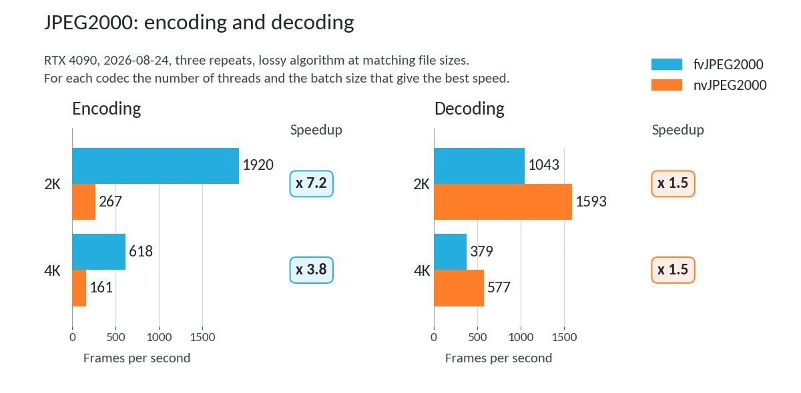
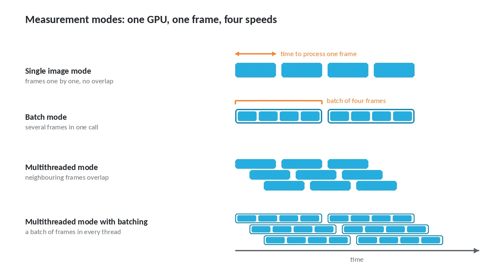
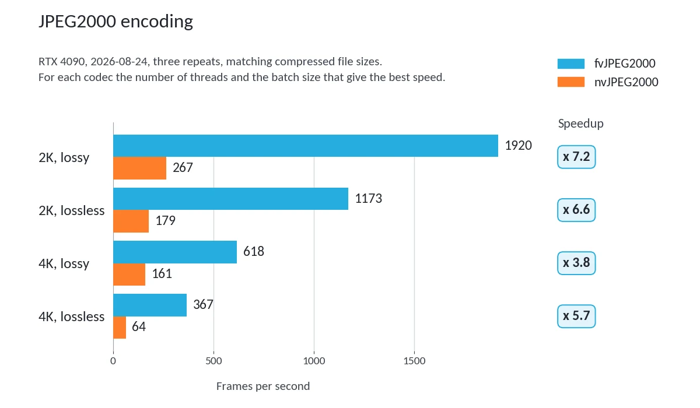
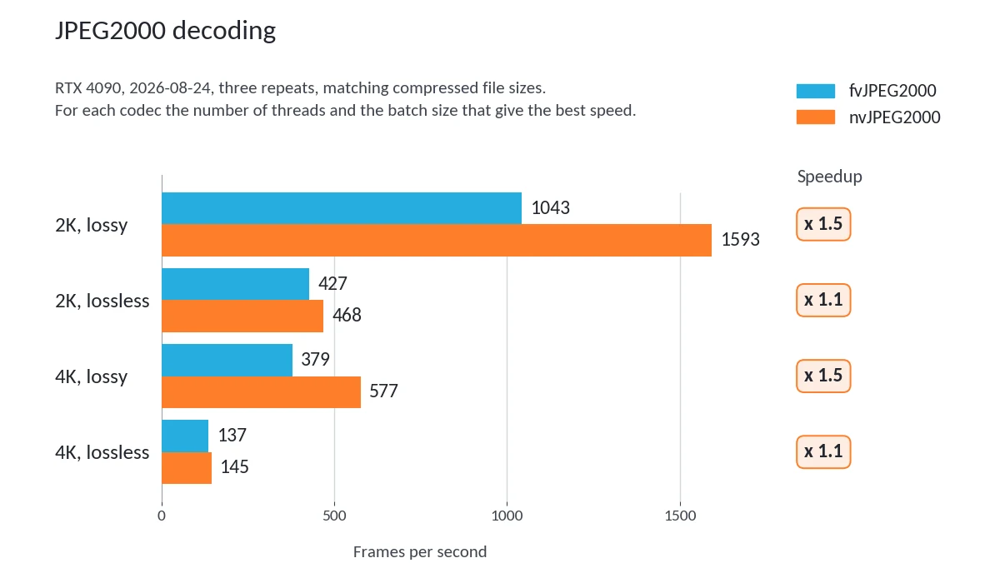
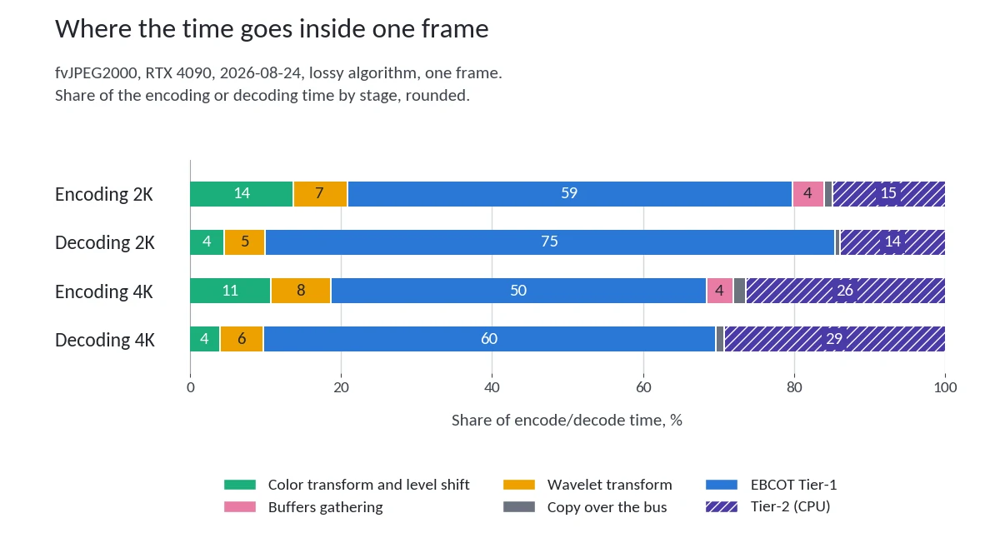
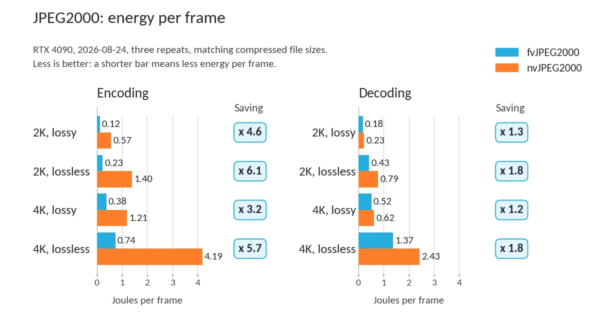

# JPEG2000 on GPU: Fastvideo SDK and nvJPEG2000 on RTX 4090

Measurement run of 24 August 2026 on an NVIDIA GeForce RTX 4090. The data
behind this text is in
[`results/2026-08-24/`](https://github.com/fastvideo/jpeg2000-benchmark/tree/main/results/2026-08-24):
tables, machine-readable results and the raw logs of every launch in
`logs.zip`.

The original of this article is published at
[www.fastcompression.com/blog/fastvideo-vs-nvjpeg2000.htm](https://www.fastcompression.com/blog/fastvideo-vs-nvjpeg2000.htm).
This copy is a snapshot: it is fixed to the run above and is not updated when
the article changes.

Text of the article: CC BY-ND 4.0. Measurement data and tables: CC BY 4.0. See
`CONTENT-LICENSE.md` in the root of the repository.

*Encoding and decoding side by side, lossy mode. On the left fvJPEG2000 is 3.8
to 7.2 times faster, on the right nvJPEG2000 is ahead.*

## Overall test results

RTX 4090, matching compressed file size, 2026-08-24, three measurement series.

**At encoding fvJPEG2000 is faster, and by a wide margin.** 1920 frames per
second against 267 on 2K lossy, 618 against 161 on 4K. The gap runs from 3.8
to 7.2 times depending on the frame and the mode. This is the typical task: a
data stream has to be compressed as fast as possible, and everything there
comes down to encoder performance.

**At decoding nvJPEG2000 is faster.** 1593 frames per second against 1043 on
2K lossy, and in single image mode the gap reaches a factor of two. In
lossless mode it almost disappears: 468 against 427.

Below is how this was measured, why it comes out this way and how to repeat it
yourself.

## 1. What is compared and why

There are currently several JPEG2000 codec implementations for the GPU, both
commercial and open source. This article compares the two codecs an engineer
most often has to choose between.

The first codec comes from the **nvJPEG2000** library by NVIDIA. The library
is free, but it ships separately from the CUDA Toolkit: it can be downloaded
from the NVIDIA site or installed from a Python package. In the rest of the
article this codec is referred to by its full name; in tables it is shortened
to **NV**.

The second one is the [JPEG2000
codec](https://www.fastcompression.com/products/gpu-jpeg2000.htm) by
**Fastvideo**, further **fvJPEG2000**, in tables **FV**. It ships as part of
the [Fastvideo SDK](https://www.fastcompression.com/products/sdk.htm) and is
licensed on a commercial basis.

**Why these two codecs?** There are others. Kakadu is a commercial JPEG2000
library from the Australian company Kakadu Software; Comprimato is a
commercial GPU JPEG2000 codec from the company of the same name. Neither of
them was tested here: we did not ask their developers for permission and we
are not going to interpret their license terms for them. The performance
measurement procedure is published in full — anyone who holds a license for
these products can run the same tests and publish their own results.

There is also the open implementation OpenJPEG, but it runs on the CPU, and
the performance gap against a GPU is very large. It makes sense to test that
codec separately.

Any engineer's first question is simple: why pay if NVIDIA already has a free
solution? Pictures and promises do not answer that question. Measurements do —
ones the reader can repeat on their own GPU, on their own images. This article
is about how to organize such measurements, and what they showed.

One caveat that matters: **we do not consider NVIDIA a competitor.**
fvJPEG2000 is written in CUDA, NVIDIA's own platform, and runs on NVIDIA GPUs.
This is a comparative analysis, not an argument: an engineering measurement of
two different implementations of one standard, with all the details needed to
repeat it.

### The idea of the article in one sentence

**What matters here is not the performance results but the method by which
they were obtained.** The results themselves go out of date with every new
version of the driver, the library and the GPU; the procedure behind them
lasts much longer. That is why the article is built so that it can be read as
a manual: how to bring two different codecs to comparable conditions, in which
modes speed can be measured and why there are at least four of them, what goes
into the measured time, and how to make sure the decoder really restored the
image instead of doing only part of the work.

Three rules follow from this, and the text returns to them in every section:

1. **Codecs have to be compared at the same result, not at the same value of
   the quality parameter.** Quality scales differ from codec to codec, and the
   common unit of measurement becomes the size of the compressed file in
   bytes. On top of that, the quality of the restored images has to be
   controlled as well — only together do these two conditions make the
   comparison correct.
2. **Encoding speed in fps means nothing without stating the operating mode
   and codec parameters.** The processing time of a single frame and the
   overall throughput under streaming processing are different valuess, and
   they can differ quite a lot.
3. **Speed alone is not enough for a comparison.** Every measurement comes
   with a full cycle: the image is encoded, decoded and compared with the
   original.

If this is all the reader takes away, the article has done its job, even if
the specific results have changed by then.

This work is the first part of a larger topic. The plans for it are collected
in section 15: the next measurements, and the open project into which the
method moves from the article into code.

## 2. Source images

*The first rule requires comparison at the same result. The result depends
entirely on what was fed in — so we have to start with the images.*

The measurements use two images that are publicly available and have been used
in public JPEG2000 benchmarks since 2019. The files can be downloaded and run
locally:
[2k_wild.ppm](https://www.fastcompression.com/img/test_j2k/2k_wild.ppm) and
[4k_wild.ppm](https://www.fastcompression.com/img/test_j2k/4k_wild.ppm). These
are ordinary photographic scenes with a wide range of detail: both smooth
areas and fine texture. Such material matters because the compression ratio at
a given quality is determined entirely by the content of the frame.

| File          |  Resolution | Channels | Bit depth | Size, MB |
|---------------|------------:|---------:|-----------|---------:|
| `2k_wild.ppm` | 1920 × 1080 |        3 | 8 bit     |     5.93 |
| `4k_wild.ppm` | 3840 × 2160 |        3 | 8 bit     |    23.73 |

The PPM format was chosen deliberately: it is an uncompressed file with a
minimal header — format, dimensions, maximum sample value (in effect, the bit
depth) — followed immediately by the image data. Such a file is read quickly
and easily, and both codecs get **exactly the same bytes** as input: no
difference in unpacking the source, no influence of third-party libraries.

What this set covers and what it does not. Two resolutions are enough to see
the main thing: how behavior changes when the frame stops being small for the
GPU. A 2K frame does not load an RTX 4090 completely, a 4K frame does — and
that changes a lot.

What the set does not cover, although both codecs can do it: **bit depth above
eight bits** per channel. Both fvJPEG2000 and nvJPEG2000 can work with data up
to 16 bits per channel, and that is exactly where medical images and satellite
frames live — the areas JPEG2000 is usually chosen for. They are not covered
in these tests: codec behavior at 12 and 16 bits requires a separate data set
and a separate analysis. The same goes for 8K frames and larger, multi-tile
images and monochrome material.

A separate caveat about the method. The measurements are arranged as "one
frame repeated N times", not "N different frames". A 2K frame takes 5.9 MB, a
4K frame 23.7 MB, and both fit entirely into the level 3 cache of a modern
CPU. That is, after the first iteration the source data is taken from the
cache, not from RAM. For estimating the speed of the algorithm itself this is
correct — we measure the codec, not the memory subsystem — but it is not the
same as processing a folder of different files.

## 3. How the parameters were chosen

This is a very important part of the work, and whether the results mean
anything at all depends on it.

### 3.1. Common denominator

The two codecs can do different things. A comparison only makes sense at those
compression parameters that are available to both, and all of them have to be
specified explicitly on both sides rather than left "at default": default
values may differ.

| Compressed file parameter | FV                 | NV                               |
|---------------------------|--------------------|----------------------------------|
| File format               | JP2                | stream_type = STREAM_JP2         |
| Wavelet, lossy            | -a irrev (CDF 9/7) | irreversible = 1                 |
| Wavelet, lossless         | -a rev (CDF 5/3)   | irreversible = 0                 |
| Code-block size           | -c 32              | code_block_w = code_block_h = 32 |
| Resolution levels         | -l 6               | num_resolutions = 6              |
| Quality layers            | 1                  | num_layers = 1                   |
| Progression order         | LRCP               | prog_order = LRCP                |
| Color transform           | enabled            | mct_mode = 1                     |
| Chroma subsampling        | 4:4:4              | full-size components             |
| Tiles                     | disabled           | enable_tiling = 0                |
| SOP and EPH markers       | disabled           | enable_SOP/EPH_marker = 0        |
| Precincts                 | default            | num_precincts_init = 0           |

Four of these rows are not an arbitrary choice but a forced one, and that is
worth saying directly.

**Code-block size 32×32.** fvJPEG2000 supports 16×16, 32×32 and 64×64,
nvJPEG2000 only 32 and 64, so 16×16 drops out of the comparison. Of the two
that remain we took 32×32: it allows a higher degree of parallelism on the
GPU.

**One quality layer.** In nvJPEG2000 the number of layers can only be one —
the interface accepts no other value. In the fvJPEG2000 encoder there is also
one layer. So per-layer quality is left out of the comparison.

**Progression order LRCP.** The fvJPEG2000 encoder produces only LRCP, the
decoder understands all five. nvJPEG2000 can do all five when encoding. The
common denominator is LRCP.

**SOP and EPH markers disabled.** In nvJPEG2000 they must be disabled, they
cannot be turned on. Accordingly they are disabled in fvJPEG2000 as well.

**Chroma subsampling 4:4:4.** Both codecs also support 4:2:2 and 4:2:0, but
the mode without chroma loss was taken for the comparison: it does not add yet
another variable to the tests and is equally available to both sides. Separate
reference points for 4:2:2 and 4:2:0 — only for fvJPEG2000 and with an
explanation of why only for it — are collected in section 9.

### 3.2. The two codecs have different quality scales

Here the two sides have to be brought to a common approach, and the two codecs
do not offer the same number of ways to set the loss.

**fvJPEG2000 has two, and they can work together.** The first is the quality
scale `q` from 0 to 100: it controls quantization, that is, how coarsely the
wavelet coefficients are rounded. The file size then comes out as a
consequence. The second is PCRD mode (Post-Compression Rate-Distortion, the
`-cr` option): you give it the compression ratio you need, and the encoder
discards the least significant bits of the code blocks until the compressed
frame fits the size that ratio implies. Here it is the other way round: the
size is set, and the quality comes out as a consequence. The two ways combine:
first quantization at the given `q`, then PCRD down to the given compression
ratio.

**nvJPEG2000 has three:** a target signal-to-noise ratio, a quantization step,
or a Q-factor on a 1–100 scale. All three tell the encoder how coarsely to
encode. A target for file size or compression ratio is not among them.

So there is exactly one common ground, the quality scale: in fvJPEG2000 it is
`q`, and of the three nvJPEG2000 scales the Q-factor works the same way.
Sections 6–10 are built on it: fvJPEG2000 encodes at `q` = 85, and nvJPEG2000
searches for the Q-factor that gives a file of the same size. PCRD mode is off
in those measurements: nvJPEG2000 has no such mode at all. How it affects
encoding speed is measured separately, in section 11.

You cannot simply set 85 on both sides and get the same compression: these are
different scales, and the files will come out different in size. And if the
sizes of the compressed frame differ, the codecs also do different amounts of
work, and any speed comparison loses its value.

How the fvJPEG2000 scale behaves on these two images:

| Quality `q` | 2K ratio | 2K file, kB | 4K ratio | 4K file, kB |
|------------:|---------:|------------:|---------:|------------:|
|          80 |   14.2:1 |         429 |   27.7:1 |         878 |
|          83 |   11.8:1 |         517 |   22.5:1 |        1078 |
|          85 |   10.3:1 |         588 |   19.5:1 |        1246 |
|          87 |    9.1:1 |         671 |   16.8:1 |        1449 |
|          90 |    7.3:1 |         828 |   13.2:1 |        1847 |

Note that at the same value of `q` the compression ratio of the two frames
differs by almost a factor of two. This is not an error and not a quirk of the
codec. The two frames are different images, and there is no point in comparing
their compression ratios with each other: at a given quality the compression
ratio is determined by the content of the frame. What matters is something
else — the same value of `q` does not give the same file size.

### 3.2.1. File size is a result, not a value you set

**The quality parameter does not fix the file size, it fixes the quantization
scheme.** The encoder decomposes the image with a wavelet transform and
quantizes the coefficients — the more coarsely, the lower the quality. How
many bytes come out of that depends on the quality factor and on the content
of the frame. File size here is not a parameter but a result.

To see this clearly, it helps to count not the compression ratio but **bits
per pixel**: how many bits on average are needed to encode one pixel of the
image. The source data is 24 bits per pixel, that is, eight bits per channel.

| Mode        | 2K, bpp | 4K, bpp |
|-------------|--------:|--------:|
| Lossy, q 85 |    2.32 |    1.23 |
| Lossless    |   11.44 |    8.65 |

**What follows from this in practice.**

First, **the phrase "compression 20:1" means nothing without stating the
image.** The same value of the quality parameter on another frame will give
another compression ratio. When codecs are compared somewhere "at 20:1
compression", the first question is: measured on what, exactly?

Second, **a value of the quality parameter cannot be carried from one project
to another and expected to give the same file size.** If a fixed size is
exactly what is needed — for example, to fit into a given bandwidth or into
storage capacity — then what is required is not a quality parameter but
bitrate control, which reduces the size of the compressed frame to the
required value. In fvJPEG2000 this is done by PCRD mode (section 3.2); it is
not used in this comparison, and how it affects speed is in section 11.

Third, this is exactly why the comparison of the two codecs is built **on
matching the size of the output file**, not on matching the value of the
quality parameter. Otherwise one of the sides would be doing less work, and
any comparison of speed would be meaningless.

### 3.3. We compare at the same compressed file size

Hence the rule: **compare not at the same value of the quality parameter but
at the same result.** Here "result" means **the size of the compressed file in
bytes**. Not "roughly similar quality", not "the same quality factor", but
precisely the size in bytes that is visible in the file properties.

The reason is that the amount of work depends directly on the file size. A
file twice as large means twice as much encoded data that the encoder has to
process. If one codec produces a file a third smaller than the other, it also
does less work, and comparing their speed is pointless: the codec that
produced the smaller file will look faster.

File size is also convenient because it is defined unambiguously. The
compression ratio depends on what is counted as the source size, and a quality
estimate depends on which quality measure was chosen.

The procedure is as follows. fvJPEG2000 encodes the reference file at quality
85. Then nvJPEG2000 searches for its Q-factor by bisection: it encodes, looks
at the size, moves the boundary, repeats — until it hits the target to within
one tenth of a percent.

The result of the search:

| Image    | Target, bytes | Q found | Result, bytes | Deviation |
|----------|--------------:|--------:|--------------:|----------:|
| 2K lossy |       601,703 |   87.29 |       601,940 |     0.04% |
| 4K lossy |     1,275,547 |   87.14 |     1,274,517 |     0.08% |

The sizes are matched to better than one tenth of a percent — the codecs have
an equal amount of work.

**How much the mapping between the two scales depends on the frame.** The
values 87.29 and 87.14 are very close, which suggests that the two quality
scales map onto each other by a constant factor. This was worth checking: if
it were so, the value found could be carried from image to image.

The check was run separately, as follows: the same search is repeated with a
tolerance twice as strict (0.05% by size), at three quality levels and from
two different initial search intervals — [1, 100] and [50, 99]. The second is
needed to separate a property of the codecs from an artifact of the search
procedure itself.

| FV quality | Equivalent for 2K | Equivalent for 4K | Difference |
|-----------:|------------------:|------------------:|-----------:|
|         80 |             74.86 |             74.77 |       0.10 |
|         85 |             87.29 |             87.17 |       0.12 |
|         90 |             94.63 |             94.56 |       0.07 |

The conclusion: **the two quality scales differ, but they are very close to
each other**, and finding the exact correspondence is outside the scope of
this work. It may well depend on the content of the frame as well. The value
found carries over to another image as a good first approximation, but a
search for a specific file size still has to be done again. That is exactly
why in the procedure the search is done for each image separately, and not
once for the whole set.

For lossless mode there is nothing to search for: there is no quality
parameter there at all, and both codecs must produce a file that decodes back
exactly. The sizes of the compressed files:

| Image       | FV file, kB | NV file, kB |  Ratio |
|-------------|------------:|------------:|-------:|
| 2K lossy    |         588 |         587 | 10.3:1 |
| 4K lossy    |        1246 |        1244 | 19.5:1 |
| 2K lossless |        2896 |        2896 |  2.1:1 |
| 4K lossless |        8754 |        8754 |  2.8:1 |

A compression ratio of about 2:1 for a lossless compression algorithm is a
usual value for JPEG2000 on photographic material, and it matches what we
publish on the pages about RAW compression.

## 4. Method: codec speed is not a single number

*One GPU and one frame give four different speeds - and all four are correct.
The difference is which work overlaps with which.*

*This section is about the second rule: a speed in frames per second means
nothing unless the mode is stated.*

The same codec on the same GPU can produce different speed values. The
difference is not in how the measurement is taken, but in what work is done in
the same amount of time — in effect, in the way the work is parallelized. So
the first question in any comparison is not only "how many frames per second",
but also "in which mode was this value obtained".

### 4.1. Measurement modes

1. **Single image mode** — in Fastvideo SDK applications this is processing of
   one image, `single image mode`, once or repeated many times (the `-repeat`
   option). When the frame is processed many times, processing of the next
   frame starts only after work on the previous one is fully finished, and the
   work runs in one thread. In effect we average the running time over
   thousands of repeats, and there is no overlap between frames. This gives
   **the processing time of a single frame** — exactly the value you need when
   response time matters. It is stable and repeatable to within one percent
   over a large number of repeats.
2. **Batch mode.** Several frames are combined by software into one larger
   virtual frame, so that this large frame is loaded into the GPU for
   processing in one go. The number of processed frames at the output stays
   the same, because the combining of frames is virtual. There are no separate
   measurements for this mode in the article: it never turns out to be the
   fastest one, so in the tables of sections 6 and 7 batching always goes
   together with threads.
3. **Multithreaded mode, several threads.** Several CPU threads, each with its
   own codec state and its own queue of GPU jobs (CUDA stream). Processing of
   different frames then overlaps — different frames are processed on the GPU
   at the same time — which increases the speed.
4. **Multithreaded mode with batching.** In addition, several frames are
   combined into one larger virtual frame, so that more data is loaded into
   each processing thread at once. This is the fastest mode in terms of
   maximum performance.

The first mode answers the question "how much time is needed to process one
frame", the others answer "how many frames per second can we process". These
are different quantities, not different accuracy for the same task: in
multithreaded mode and in batch mode the latency of a single frame is
**worse** than in single image mode — that is the price of higher overall
throughput.

There is, of course, also the option of processing images on several GPUs at
once, but this article does not cover it. What is discussed here is
compression and decompression performance on a single GPU.

How much this matters: with fvJPEG2000 encoding 2K with lossy compression,
single image mode gives 378 frames per second, while the best combination of
threads and batch gives 1920. That is a difference of more than five times, on
the same GPU, on the same frame, at the same compression. With nvJPEG2000 on
the same task the picture is quite different: 197 and 267, that is, about 1.4
times. The same question "how many frames per second" has different answers
for the two codecs depending on the mode — so it matters which mode you are
in.

### 4.2. What is included in the measured time and what is not

The second question after the mode is what exactly falls inside the measured
time.

*For the encoder the timer starts when the source image is already in GPU
memory and stops when the compressed image is in host RAM. Tier-2 and building
the compressed image on the CPU are inside the measured time on both sides.*

In both cases the timing rule is the same for the encoder and the decoder, and
it is mirrored:

- **for the encoder** — from the source image in GPU memory to the compressed
  image in host memory;
- **for the decoder** — from the compressed image in host memory to the
  reconstructed image in GPU memory.

**What time is measured.** The measured time includes all the work of the
codec, all its stages one after another. For the encoder this is data
preparation and color transform, the wavelet transform, quantization and EBCOT
Tier-1 on the GPU, then the transfer of the result to the CPU and Tier-2 —
building the compressed image. For the decoder it is the same in reverse
order. What is not included is the transfer of the image itself — uploading
the source frame into GPU memory for the encoder, reading the restored frame
back for the decoder — and reading from or writing to disk. The fact that part
of the work runs on the CPU is not a flaw of the measurement but a property of
JPEG2000: not every stage of this algorithm can be parallelized efficiently.

Separately about the part of the work that runs on the CPU. The heaviest stage
of JPEG2000, EBCOT Tier-1, is computed on the GPU. Tier-2 — building the
compressed image out of the finished packets when encoding, parsing its
structure when decoding — is arranged differently in the two codecs, and what
is known about it differs as well.

**In fvJPEG2000** Tier-2 runs on the CPU, both when encoding and when
decoding.

**In the nvJPEG2000 decoder** it runs on the CPU as well, and the NVIDIA
documentation states this directly: "Tier 2 decode stage (first stage of
decode) is run on the CPU. All other stages of the decoding process are
offloaded to the GPU"
([docs.nvidia.com](https://docs.nvidia.com/cuda/nvjpeg2000/introduction.html)).
In the program this is the `nvjpeg2kStreamParse` step: it takes the compressed
image from host memory and parses its structure.

**For the nvJPEG2000 encoder the documentation makes no such definite
statement.** All it says is that the library uses both the GPU and the CPU to
create JPEG2000 bitstreams, that the source image must be in GPU memory and
that the compressed image is written to host memory. Which part of the work
goes to the CPU is not stated, and we did not look at the encoder with a
profiler. So we do not claim it either: that the CPU is at work during
encoding follows from the documentation, that Tier-2 in particular runs on it
does not. This item is listed in section 16, among the unverified ones.

**All CPU work is inside the measured time on both sides.** Taking this part
out of the brackets would be incorrect: in fvJPEG2000 the CPU work is included
in the measured time, so it must be included for nvJPEG2000 as well.

The disk is excluded from this test completely: nothing is written out.
Otherwise we would also be measuring the speed of the storage device, not just
the speed of the codec.

### 4.3. The optimum is found by search, not assigned

The number of CPU threads and the batch size are not a "reasonable choice" but
values found by search. The optimum lies inside the range, and in different
tasks it may be in a different place. For the fvJPEG2000 encoder at 2K
batching helps noticeably: eight threads with a batch of two give 1920 frames
per second against 1765 for eight threads without batching, while sixteen
threads turn out to be slower than eight. At 4K the picture is different: 8×1,
8×2 and 16×2 give 618, 613 and 612 frames per second — the same value within
the spread between measurement series. A large frame loads the GPU even
without batching, and there is nothing left to add.

That is why the measurement conditions publish **the full list of combinations
used**, not the winning one: what is reproduced is the procedure, not a
ready-made combination. Four combinations were tried, written as "number of
threads × batch size": 8×1, 8×2, 16×2 and 8×4. The notation 16×2 reads as
follows: sixteen CPU threads, each with two frames at a time.

The tables below give all four combinations and, separately, the best one for
each codec. In the rest of the article, instead of "the best combination of
number of threads and batch size", we say **the best combination of threads
and batch** for short.

**An important caveat: batching works differently in the two codecs.** This
has to be said outright, otherwise the same word in the tables would mean two
different things.

First, about what the notation itself means. **8×2 is eight CPU threads, and
in each of them two frames are in flight on the GPU at the same time.** There
are exactly eight CPU threads at any batch size; they do not double. Something
else doubles — the number of jobs the GPU computes at the same moment: not
eight, but sixteen.

In fvJPEG2000 these two frames go into the codec in a single call: the batch
is real, and the codec handles them as one job. This is a standard capability
of Fastvideo SDK.

nvJPEG2000 has no such call. Not a single function in the library accepts an
array of images — only one image per call. So the GPU load is built up
differently: **each thread creates as many independent codec states and as
many CUDA streams as the batch size specifies.** The thread submits encoding
of the first frame to its first stream, and immediately after it, without
waiting for the result, the second frame to the second stream, and only then
waits for both. The calls are asynchronous and the streams are independent, so
both frames are computed on the GPU at the same time.

**What this is built from.** Everything here is standard: multiple codec
states, CUDA streams and asynchronous calls are all regular features of the
NVIDIA library and of CUDA, and there are no workarounds involved. Only one
thing is missing from the library — a call that accepts several frames at
once. So the order of the calls has to be built by hand: the library provides
the building blocks, but not a ready-made mode.

This is also worth saying because **it does not work by itself**. A program
that simply calls nvJPEG2000 one frame per thread — and that is exactly how
the NVIDIA samples are built — will get eight simultaneous jobs instead of
sixteen, and the result will be lower. The extra speedup from this
construction for nvJPEG2000 is real: 1.21x for the encoder and 1.12x for the
decoder.

We still report exactly these values and take them as the best for nvJPEG2000:
the comparison must be against the maximum that can be obtained from the
library, not against what the standard way of using it gives.

### 4.4. What was not measured

Tiles, decoding of a selected region, bit depth above eight bits,
multi-component transforms beyond the standard ones, operation on Jetson. Some
of this exists on only one of the two sides and is compared by a feature
table, not by speed; some of it is a separate piece of work.

## 5. Test system

*A performance result without a description of the conditions it was obtained
in is useless. All the test conditions are listed here, with the software and
hardware parameters, together with the date; this matters.*

| Item                          | Value                             |
|-------------------------------|-----------------------------------|
| GPU                           | NVIDIA GeForce RTX 4090, 24 GB    |
| GPU driver                    | 610.88                            |
| GPU maximum power             | 450 W                             |
| CPU                           | AMD, 32 threads                   |
| RAM                           | 128 GB                            |
| Fastvideo JPEG2000 codec (FV) | Fastvideo SDK 0.23.1.0, CUDA 13.3 |
| nvJPEG2000 library (NV)       | version 0.11.0.51                 |
| Operating system              | Windows 11                        |
| Bus speed, measured           | 25.2 GB/s from CPU to GPU         |
| Measurement series per point  | 3, the tables show the median     |
| Measurement date              | 24 August 2026                    |

All the measurements are run by a single script: it prepares the reference
files, runs the quality search, measures the performance of both
implementations, checks the quality of the restored image and prints a ready
table. This takes from ten minutes to half an hour, depending on the number of
repeats and the checks enabled. The script picks how many frames to process in
each test on its own: first a short speed probe, then a calculation against
the time budget. So the measurements fit into the allotted time on any GPU.

## 6. Encoding

*Encoding in multithreaded mode: for each codec the number of threads and the
batch size that give the best speed. Same values as in the table below.*

*The results follow. Their value rests entirely on sections 3 and 4: the same
file size on both sides, the same compression parameters and a chosen
operating mode.*

All values in the table are fps. The first column comes from single image
mode, the other four from multithreaded mode with different combinations of
"number of threads × batch size". The best value in a row is in bold, and the
same combination is named in the last column.

| Task             | single |     8×1 |      8×2 |    16×2 |  8×4 | best |
|------------------|-------:|--------:|---------:|--------:|-----:|-----:|
| 2K, lossy, FV    |    378 |    1765 | **1920** |    1665 | 1916 |  8×2 |
| 2K, lossy, NV    |    197 |     205 |      249 | **267** |  226 | 16×2 |
| 2K, lossless, FV |    328 |    1117 | **1173** |    1008 | 1120 |  8×2 |
| 2K, lossless, NV |    146 |     158 |      164 | **179** |  164 | 16×2 |
| 4K, lossy, FV    |    195 | **618** |      613 |     612 |  599 |  8×1 |
| 4K, lossy, NV    |    127 |     133 |      143 | **161** |  142 | 16×2 |
| 4K, lossless, FV |    140 | **367** |      350 |     296 |  333 |  8×1 |
| 4K, lossless, NV |     56 |      62 |       63 |  **64** |   63 | 16×2 |

How many times faster fvJPEG2000 is than nvJPEG2000 at encoding:

| Encoding     | FV over NV single image mode | FV over NV threads and batch |
|--------------|-----------------------------:|-----------------------------:|
| 2K, lossy    |                        1.92x |                        7.19x |
| 2K, lossless |                        2.25x |                        6.54x |
| 4K, lossy    |                        1.53x |                        3.84x |
| 4K, lossless |                        2.49x |                        5.73x |

**In single image mode the fvJPEG2000 encoder is 1.5 to 2.5 times faster than
the nvJPEG2000 encoder.** This is about encoding only; decoding gives a
different picture, it is in the next section. This comparison does not depend
on parallel processing between frames: one frame, one CPU thread, files of the
same size.

**The nvJPEG2000 encoder gains almost nothing from multithreaded mode.** All
its results sit in a narrow band: from 205 to 267 frames per second on 2K and
from 133 to 161 on 4K. Going from single images to 8 threads increases the
speed by only four percent; after that only batching adds a little. For
comparison, fvJPEG2000 on the same task speeds up by a factor of 4.7 when
going from single images to 8 threads.

We checked whether this was a bug in the benchmark harness. A separate check
runs at the best combination of threads and batch for nvJPEG2000 — sixteen
threads, batch of two, four hundred frames in a row, a single run with no
averaging over three series. In this form the encoder gives 280 frames per
second on 2K and 146 on 4K; the table above shows 267 and 161, because those
are medians over three series. If the copy of the image from host memory into
GPU memory is removed from the same loop, the result is 297 and 173.

The copy does cost time, as it should — from six to nineteen percent — but
even without it the encoder stays 3.6 to 6.5 times slower than fvJPEG2000, and
multithreading still gives it almost no speedup.

The same benchmark harness, the same GPU, the same threading scheme — and the
decoder of the same library speeds up by a factor of 5.4 under it. So the
cause is not how the benchmark harness is written, but that the nvJPEG2000
encoder and decoder are built differently.

## 7. Decoding

*Decoding in multithreaded mode with batching: for each decoder the number of
threads and the batch size that give the best speed were used.*

| Task             | single |  8×1 |      8×2 |    16×2 |      8×4 | best |
|------------------|-------:|-----:|---------:|--------:|---------:|-----:|
| 2K, lossy, FV    |    143 |  431 |      649 |     892 | **1043** |  8×4 |
| 2K, lossy, NV    |    296 | 1421 | **1593** |    1473 |     1575 |  8×2 |
| 2K, lossless, FV |    116 |  276 |      356 |     425 |  **427** |  8×4 |
| 2K, lossless, NV |    236 |  446 |  **468** |     468 |      468 |  8×2 |
| 4K, lossy, FV    |     96 |  244 |      351 | **379** |      330 | 16×2 |
| 4K, lossy, NV    |    193 |  496 |  **577** |     573 |      569 |  8×2 |
| 4K, lossless, FV |     59 |  133 |      129 | **137** |      120 | 16×2 |
| 4K, lossless, NV |     91 |  132 |  **145** |     144 |      144 |  8×2 |

Here the picture is reversed. How many times faster nvJPEG2000 is than
fvJPEG2000 at decoding:

| Decoding     | NV over FV single image mode | NV over FV threads and batch |
|--------------|-----------------------------:|-----------------------------:|
| 2K, lossy    |                        2.07x |                        1.53x |
| 2K, lossless |                        2.04x |                        1.10x |
| 4K, lossy    |                        2.01x |                        1.52x |
| 4K, lossless |                        1.53x |                        1.06x |

**In single image mode the nvJPEG2000 decoder is 2 times faster** in three of
the four combinations, and 1.53 times faster on 4K lossless. This is the most
serious result of the tests, and it is not in favour of fvJPEG2000.

**At the best combination of threads and batch the gap narrows, and with
lossless compression it almost disappears.** With lossy compression nvJPEG2000
stays ahead by about one and a half times; with lossless compression the
difference falls to five or ten percent: 468 frames per second against 427 on
2K and 145 against 137 on 4K.

The files from the two encoders are of the same size, but inside they are
built differently, and in theory one of them could give the decoder less work.
This is checked by cross-decoding: each decoder is run on a file made by the
other encoder. The difference across all eight combinations of conditions did
not exceed one percent, and in two cases it was zero. So the decoder
comparison is correct: the files put the same load on them, and the result
applies to the decoders themselves.

## 8. Where the speedup comes from

*Where the time goes inside one frame. EBCOT Tier-1 takes half to three
quarters of it, and Tier-2 runs on the CPU — that is why threads and batching
help as much as they do.*

The speedup accumulates on several levels at once, and they do different
things.

**Inside each stage of the JPEG2000 algorithm.** This is the lowest level, and
the tables do not show it at all: each stage — the wavelet transform,
quantization, EBCOT Tier-1 — is itself spread over thousands of parallel GPU
threads (CUDA threads). How efficiently that is done determines the frame
processing time in any mode. The most accurate timing per stage comes from a
profiler. The fvJPEG2000 codec has an `-info` option that prints the running
time of every stage of encoding or decoding for a given frame.

**Batching** glues several frames into one for processing: the GPU sees one
large frame instead of several small ones. nvJPEG2000 has no batching, and its
role is played by the technique from section 4.3 — several frames in flight on
the GPU at the same time within a single thread. Neither of the two overlaps
stages — they only increase the load. Hence a consequence that the
measurements confirmed: batching helps at 2K and is useless or harmful at 4K,
where a single frame already loads the card. For the fvJPEG2000 encoder at 4K
the best combination turned out to be 8×1, that is, eight threads with no
batching at all: in lossless mode it is ahead, and in lossy mode it is level
with 8×2 — the difference there is smaller than the spread between measurement
series.

**Multithreading** parallelizes the work, and processing of one frame can run
in parallel with processing of another frame on the GPU.

**Separate read and write pools** reduce the latency related to the disk. They
are not used in these tests: the disk is excluded. But fvJPEG2000 does have
that option.

A separate breakdown shows how large the contribution of each technique is.
Take a 2K frame in lossy mode and look at how many times the frames per second
grow as extra techniques are switched on — first for the encoders, then for
the decoders. There are no new measurements here: all speeds are taken from
the tables of sections 6 and 7, from the "2K, lossy" rows.

It is calculated as follows. Single image mode is taken as the unit — there
frames go one at a time and nothing overlaps. Then multithreading is switched
on without batching, that is, the 8×1 combination: the ratio to single image
mode shows what multithreading gave. Then the best combination of threads and
batch is taken; the ratio to 8×1 shows what the move to it added. The last
column is the product of the first two, that is, the total speedup relative to
single image mode.

In the table below the first three columns are frames per second, taken
directly from the table in section 6. The last three are ratios of those
numbers; they are rounded, but computed from the unrounded frames per second.

| Encoder    | Single image mode |  8×1 | Optimum    | What multithreading gave | What the move to the optimum gave | Total speedup |
|------------|------------------:|-----:|------------|-------------------------:|----------------------------------:|--------------:|
| fvJPEG2000 |               378 | 1765 | 1920 (8×2) |                     4.7x |                              1.1x |          5.1x |
| nvJPEG2000 |               197 |  205 | 267 (16×2) |                     1.0x |                              1.3x |          1.4x |

**The column "what the move to the optimum gave" means different things for
the two encoders**, and that has to be said directly. For fvJPEG2000 the best
combination turned out to be 8×2: the same number of threads, only batching
was added — so 1.1x here is the contribution of batching in its pure form. For
nvJPEG2000 the best one turned out to be 16×2: twice as many threads and two
frames in flight in each of them — so 1.3x is the contribution of both changes
at once. nvJPEG2000 has no batching at all: two frames at a time are obtained
by the technique from section 4.3 — separate codec states and separate job
queues within a thread.

The nvJPEG2000 encoder gets no speedup from multithreading at all — the factor
is 1.04, that is, four percent, which is comparable to the spread of the
measurements themselves. Everything it gains comes not from multithreading but
from a denser load on the card: twice as many threads and two frames in flight
in each. In total this is 1.4 times against 5.1 for fvJPEG2000 — and that is
exactly where the gap comes from that reaches seven times in section 6.

For the decoders the picture is different, and the gap there is much smaller.

In the table below the speeds are taken from the table in section 7. For both
decoders the best combination is eight threads, the same as in the 8×1 column:
only the number of frames in flight inside a thread changes.

| Decoder    | Single image mode |  8×1 | Optimum    | What multithreading gave | What the move to the optimum gave | Total speedup |
|------------|------------------:|-----:|------------|-------------------------:|----------------------------------:|--------------:|
| fvJPEG2000 |               143 |  431 | 1043 (8×4) |                     3.0x |                              2.4x |          7.3x |
| nvJPEG2000 |               296 | 1421 | 1593 (8×2) |                     4.8x |                              1.1x |          5.4x |

This reads as follows: multithreading makes the fvJPEG2000 decoder three times
faster, and a batch of four frames adds another 2.4 times, together 7.3 times
relative to single image mode. For the nvJPEG2000 decoder it is the other way
round: multithreading gives more (4.8 times), while the second frame in a
thread adds almost nothing (1.1 times), and the result is 5.4 times.

**How the frame processing time is distributed between the stages of
JPEG2000.** The Fastvideo test application with the `-info` option prints the
time of every stage separately. The stages in the table below are named as in
that output and follow the same order — for the encoder from the source pixels
to the compressed image, for the decoder the other way round. The numbers are
the median of five runs from the same series of 24 August, a 2K frame and a 4K
frame, lossy compression; the logs of all runs are in the repository.

**This is an estimate, not a measurement, and here is why.** The codec reports
stage times only for a single frame: when running with repeats it does not
print them at all — this breakdown is only meant for estimating where the time
goes. So one-off costs land inside every stage: the first kernel launch, the
card coming up to speed and the synchronizations that the option itself
inserts. How much that is can be seen in the two bottom rows of the table: the
sum of the stages is 4.72 ms against a real 2.65 ms for encoding 2K. The extra
two milliseconds are smeared across the stages, and they distort the fast
stages on a small frame most of all: the color transform with the level shift
takes 0.64 ms on 2K and 0.72 ms on 4K, although the frame is four times
larger. So almost all of that time does not depend on the frame size and is
not work. The shares in the table should be read as an order of magnitude, not
as exact percentages.

**The breakdown exists only for fvJPEG2000.** The nvJPEG2000 library does not
report stage times; its test application prints only the total, so the codecs
cannot be compared stage by stage — the table describes how one codec is
built, not an advantage of one over the other.

Two rows of the table are worth decoding. **The color transform and the level
shift** come first for the encoder and, in the inverse direction, last for the
decoder, so in the table this is a single row with numbers on both sides.
**Buffers gathering** is the collection of the finished code-blocks into one
contiguous buffer before the transfer to the CPU.

In the table below the shares are rounded to whole percent, so a column may
add up to 99 or 101. The bottom row is the time of a single frame in single
image mode from sections 6 and 7, for comparison with the sum of the stages.

| Stage                           | Where | Encoding 2K | Encoding 4K | Decoding 2K | Decoding 4K |
|---------------------------------|-------|------------:|------------:|------------:|------------:|
| Color transform and level shift | GPU   |         14% |         11% |          4% |          4% |
| Wavelet transform               | GPU   |          7% |          8% |          5% |          6% |
| EBCOT Tier-1                    | GPU   |         59% |         50% |         75% |         60% |
| Buffers gathering               | GPU   |          4% |          4% |           — |           — |
| Copy over the bus               | —     |          1% |          2% |          1% |          1% |
| Tier-2                          | CPU   |         15% |         26% |         14% |         29% |
| Sum of the stages, ms           | —     |        4.72 |        6.76 |        8.51 |       12.23 |
| Real frame time, ms             | —     |        2.65 |        5.13 |        6.97 |       10.43 |

**About quantization.** It has no row of its own in this output: it is not
separated into a stage, it runs on the GPU inside the neighbouring stages and
has no timer of its own. One more item of the output is not a stage and did
not make it into the table — the line "PCRD is disabled": it confirms that the
search for a given file size is switched off in these measurements, as stated
in sections 3.2.1 and 11. Writing the finished file to disk is printed
separately by the program and marked as excluded from the count.

Three conclusions from this estimate are large enough that the one-off costs
do not cancel them.

**The main work is entropy coding, EBCOT Tier-1.** From a half to three
quarters of the whole time, and it is exactly what determines the speed of the
codec. Everything else together weighs less.

**The CPU work grows with the frame size, the GPU work almost does not.**
Tier-2 takes 0.71 ms on 2K and 1.79 ms on 4K when encoding, 1.19 and 3.59 ms
when decoding — that is, two and a half to three times more on a frame four
times larger. Over the same step the GPU stages add tenths of a millisecond.
This is exactly the CPU work mentioned in section 4.2, and on a large frame it
turns from a detail into a quarter of the time.

**The inverse color transform and level shift in the decoder weigh little** —
0.38 ms out of seven on 2K. This matters for comparing the decoders: the
nvJPEG2000 test application leaves the result as separate planes and does not
do this work (section 16). Its contribution is small and does not affect the
conclusion.

**How repeatable the results are.** Each point was measured three times; the
median goes into the tables. The spread between series: for fvJPEG2000 on
encoding it is 3% on average and up to 14% at the worst point, on decoding 2%
on average; for nvJPEG2000 about one percent on average and up to 12% in the
worst case. The main conclusions in this article rest on differences of
several times, that is, clearly larger than the spread.

A separate note on the dependence on data volume. In lossless compression
there is five times more data, and both sides run into the efficiency of
entropy decoding — there the results nearly converge. In lossy compression
there is little work, and then the fixed per-frame overhead decides, and
fvJPEG2000 loses on that: the gap in milliseconds barely grows, even though
there is five times more work.

## 9. Chroma subsampling: reference points for fvJPEG2000

*Why this section. The whole comparison above runs on material without
subsampling, i.e. 4:4:4 — that is a correct common denominator. But in real
pipelines chroma is often subsampled, and the question "how much does it give"
is asked all the time. Here are a few reference points, so that the order of
magnitude is known.*

**What chroma subsampling is.** The human eye distinguishes changes in
brightness noticeably better than changes in color. A technique more than half
a century old is built on this: the image is converted from red-green-blue
into luma plus two color differences, and the color differences are stored at
a lower resolution.

- **4:4:4** — chroma is stored in full, nothing is thrown away;
- **4:2:2** — chroma is subsampled by two horizontally;
- **4:2:0** — by two both horizontally and vertically, that is, a quarter of
  the samples is left in the color channels.

It helps to count in terms of input data: at 4:4:4 there are three samples per
pixel, at 4:2:2 two, at 4:2:0 one and a half. That is, **before encoding**
there is 1.5 and 2 times less data respectively. Hence the double effect: the
file comes out smaller, and encoding is faster, because there is physically
less work.

An important caveat: this is loss **on top of** what quantization gives. On
photographic material it is hard to notice; on sharp color edges — for
example, on colored text, diagrams, titles — it is visible at once. That is
why film production and master copies stay at 4:4:4, while streaming and
broadcast move to 4:2:2 and 4:2:0.

**Why nvJPEG2000 is not in this table.** Not because the library cannot do it,
but because the comparison would be incorrect. The NVIDIA codec takes
components already brought to the required size: the subsampling itself would
have to be done outside, by third-party code. Then the measured time would
include the time of our subsampling filter, and it would no longer be the
codecs being compared. Such a comparison is worth making, but separately and
with the filter stated explicitly.

The "Single" and "Multithreaded" columns of the table below give encoding fps.

The quality parameter is the same in all rows, `q` = 85: only the sampling
mode changes. PSNR is computed against the original full-color frame, so it
also includes the loss from subsampling — that is exactly the price one needs
to know in advance.

| Frame | Format | File, kB |  Ratio | Single | Multithreaded | PSNR, dB |
|-------|-------:|---------:|-------:|-------:|--------------:|---------:|
| 2K    |  4:4:4 |      588 | 10.3:1 |    379 |          1912 |     40.4 |
| 2K    |  4:2:2 |      508 | 12.0:1 |    396 |          2000 |     38.6 |
| 2K    |  4:2:0 |      457 | 13.3:1 |    405 |          2094 |     37.3 |
| 4K    |  4:4:4 |     1246 | 19.5:1 |    195 |           579 |     42.0 |
| 4K    |  4:2:2 |     1123 | 21.6:1 |    211 |           692 |     40.8 |
| 4K    |  4:2:0 |     1042 | 23.3:1 |    224 |           720 |     39.9 |

The 4:4:4 row here is the same configuration as in section 6, but the results
are slightly different: 379 and 1912 against 378 and 1920. These are different
parts of one measurement run, and the discrepancy fits within the spread
between series given in section 8. Values should be compared within one table,
not between tables.

**What follows from this.** There is a gain, but it is noticeably more modest
than the volume of the input data would suggest. At 4:2:2 there is a third
less data before encoding, while the file shrinks by 13% (2K) and by 10% (4K);
at 4:2:0 there is half as much data, while the file shrinks by 22% and by 16%.
The reason is simple: after the conversion to luma and color differences the
chroma channels already compress harder than the luma one, and the codec has
already taken most of that redundancy. Subsampling takes away what is left.

Speed grows about as modestly: at 2K, from 4:4:4 to 4:2:0, encoding gets 7%
faster in single image mode and 10% faster in multithreaded mode; at 4K, 15%
and 24%. On large frames the effect is stronger, because there more time goes
into processing the samples themselves rather than into the fixed overhead.

Quality, however, drops quite noticeably: at 2K, from 4:4:4 to 4:2:0, 3.1 dB
is lost; at 4K, 2.1 dB. Part of this loss is irreversible — subsampled chroma
cannot be restored, whereas quantization can be relaxed simply by raising the
quality parameter.

Hence the practical conclusion: if the task is to make the file smaller,
raising the compression ratio at 4:4:4 is usually a better deal than moving to
4:2:0. Subsampling makes sense where it is already present in the input stream
(the material came from the camera in 4:2:2 and there is no point in
converting it to 4:4:4), or where the constraint is not on the file but on the
volume of data that has to be pushed through the pipeline.

## 10. Quality control

*Third rule: speed alone is not enough for a comparison.*

Measuring speed without checking the result guarantees nothing: a decoder that
does less work than it should looks faster. So on every run, for each of the
eight combinations of conditions, a full cycle is performed: the image is
encoded, decoded and compared with the original.

**Lossless mode: exact match.** All four combinations — both codecs, both
frames — produced a decoded image bit-for-bit equal to the original. This is a
mandatory condition: if there were no match in even one case, it would no
longer be lossless compression and there would be nothing to compare the
speeds against.

**Lossy mode: signal-to-noise ratio.** The comparison runs at a matched file
size, so the table answers a direct question — at the same file size, who has
less distortion.

| Image | fvJPEG2000, dB | nvJPEG2000, dB | Difference |
|-------|---------------:|---------------:|-----------:|
| 2K    |          40.42 |          40.60 |       0.18 |
| 4K    |          41.97 |          42.23 |       0.26 |

The difference favours nvJPEG2000, but it is small. For a sense of scale: a
difference of 1 dB on photographic material is usually already
indistinguishable by eye, and tenths lie within what the choice of parameters
inside a single codec gives. So at an equal file size the quality of the two
implementations is practically the same — and that is exactly the conclusion
that was needed: it confirms that the speed comparison is made at a comparable
result, and not because one codec saves on quality.

**About the watermark.** Demo builds of the codecs put a watermark on the
frame, and then the decoded frame cannot be compared directly with the
original file: it would be the watermark being measured, not the codec. These
measurements were made on a build without the watermark, and the benchmark
harness verified this: neither codec had a watermark, so PSNR was computed
directly against the original.

The quality check is reproducible on the demo version as well, and no special
build is needed for it. The technique is this: the reference for PSNR is not
the original file but the frame that came back through a **lossless** round
trip on the same build. The watermark is applied before encoding, and lossless
mode preserves everything bit-for-bit — so such a reference is exactly what
the encoder received, and PSNR measures the encoding loss, not the watermark.
The harness also checks this very condition: two independent lossless round
trips must match byte for byte. All of this is already built into the script
and turns on by itself.

## 11. PCRD mode: a fixed file size and encoding speed

In the previous sections both codecs worked the same way: we set a quality
parameter, and the size of the compressed file came out as a consequence. In
production that is not always the case. Often the bandwidth of the channel or
the capacity of the medium is known in advance, and the frame has to fit a
given size: compress by exactly a factor of twenty, or fit into so many
megabytes.

The fvJPEG2000 codec can do this directly: in PCRD mode you set the
compression ratio you need, and the encoder itself decides which least
significant bits to discard in order to reach it. nvJPEG2000 has no such mode,
so this whole section is about fvJPEG2000 only: there is nothing to compare.

**Quantization and PCRD mode work in sequence, quantization first, then
PCRD.** The wavelet coefficients are quantized according to the quality
parameter, and then PCRD discards as many least significant bits as it takes
to reach the given compression ratio (section 3.2). That is how it is normally
used: the base quality is chosen in advance, on frames of the same kind, and
the `-cr` option sets the final file size.

Two measurements follow. The first shows how fast PCRD mode itself runs at
different compression ratios. The second answers the main question of this
section: how much slower the encoder is when a file of one and the same size
is produced with this mode and without it.

**First, the mode itself at different compression ratios.** Quantization here
ran at `q` = 100, that is, it was relatively weak, and the resulting
compression ratio was set mainly by the `-cr` option.

The table below is about encoding only: PCRD mode works on the encoder side,
the decoder knows nothing about it and simply reads a finished file. The
values were obtained in single image mode — frames are processed one at a
time, without multithreading and without batching (section 4.1).

| Frame | Compression ratio | File, kB | Encoder, fps |
|-------|------------------:|---------:|-------------:|
| 2K    |               5:1 |     1213 |          197 |
| 2K    |              10:1 |      602 |          206 |
| 2K    |              20:1 |      295 |          217 |
| 4K    |               5:1 |     4662 |          123 |
| 4K    |              10:1 |     2408 |          119 |
| 4K    |              20:1 |     1182 |          118 |

Encoding speed hardly depends on which compression ratio was requested: at 4K
it is 123, 119 and 118 frames per second at 5:1, 10:1 and 20:1. That is what
one should expect while quantization stays at `q` = 100: the amount of data to
encode is the same, and the compression ratio changes only how many least
significant bits are discarded afterwards.

**Now the main point: how much PCRD mode slows encoding down.** To keep the
comparison correct, every variant produces a file of one and the same size —
the size that quality `q` = 85 gives: 588 kB at 2K and 1246 kB at 4K. That is
the quality sections 6–10 work at. The same size is reached in four ways: by
quantization alone, without PCRD, and by three more where PCRD brings the size
down — at `q` = 90, 95 and 100.

The "single image mode" and "threads and batch" columns below give frames per
second in two measurement modes: one frame at a time, and at the combination
of thread count and batch size that came out best for that row (given in
brackets). The "slowdown" column shows how many times slower a row is than the
first row for the same frame — the one with PCRD off. The file sizes agree
across all rows to better than one tenth of a percent, so the rows can be
compared with each other.

All the numbers in the table below come from a single run, so they can be
divided by one another. The rows without PCRD are the same mode that produced
the table in section 6; the speeds measured here differ from the published
ones by a few percent.

| Frame | Quality `q` and mode | Single image mode |  Slowdown | Threads and batch |  Slowdown | PSNR, dB |
|-------|----------------------|------------------:|----------:|-------------------|----------:|---------:|
| 2K    | 85, no PCRD          |             358.5 |         — | 1879 (8×2)        |         — |    40.41 |
| 2K    | 90 and PCRD          |             211.5 |     1.70× | 823 (8×1)         |     2.28× |    39.80 |
| 2K    | 95 and PCRD          |             201.5 |     1.78× | 755 (8×1)         |     2.49× |    39.74 |
| 2K    | 100 and PCRD         |             194.6 | **1.84×** | 681 (8×1)         | **2.76×** |    39.25 |
| 4K    | 85, no PCRD          |             187.2 |         — | 614 (8×1)         |         — |    41.97 |
| 4K    | 90 and PCRD          |             134.1 |     1.40× | 400 (8×1)         |     1.54× |    41.50 |
| 4K    | 95 and PCRD          |             129.1 |     1.45× | 362 (8×1)         |     1.70× |    41.51 |
| 4K    | 100 and PCRD         |             120.1 | **1.56×** | 314 (8×1)         | **1.96×** |    41.24 |

**How much the encoder slows down depends on whether quantization was set.**
If quantization stays at `q` = 100 and the compression ratio is reached by
PCRD alone, the encoder runs 1.56 times slower at 4K and 1.84 times slower at
2K. If quantization is set in advance, part of the speed comes back: at 4K the
gap narrows from 1.56 to 1.40 times. About a quarter to a third comes back,
and it cannot come back in full — the PCRD stage itself remains in any case,
and the first row does not have it at all.

**In multithreaded mode the gap is larger than in single image mode.** At 2K
it is 1.84 times by single frames and 2.76 times at the best combination of
threads and batch; at 4K, 1.56 and 1.96 times. The difference is substantial:
if a system is sized by total throughput, what PCRD mode takes away will be
noticeably more than single image mode suggests.

**At one and the same file size PCRD mode also gives slightly worse image
quality.** At 2K the PSNR is 39.25 dB against 40.41 dB in the row without
PCRD; at 4K, 41.24 against 41.97. The pattern is the same in every row: the
lower the quality level, the less data reaches the entropy encoder, so
compression runs faster. `q` = 90 is faster than `q` = 95, and `q` = 95 is
faster than `q` = 100. By PSNR the two combinations are almost equal, and both
are noticeably better than PCRD alone.

**What remains is to work out which quality to set.** In the table above the
best variant is `q` = 90, but there is a gap between it and `q` = 85: at 85
the frame already comes out at the required size and PCRD has nothing to trim,
while at 90 the natural size is already one and a half times the target. The
optimum lies somewhere between them, so `q` = 86, 87 and 88 were measured
separately.

This is a separate run, so the absolute speeds in it are slightly higher than
in the table above — a different measurement session. What has to be compared
are the ratios, and they agree: the "100 and PCRD" row gives 1.79 times at 2K
and 1.54 times at 4K here, against 1.84 and 1.56 in the previous run. All
measurements are in single image mode, and the file sizes are matched to
better than one tenth of a percent.

| Frame | Quality `q` and mode | Encoder, fps |  Slowdown | PSNR, dB |
|-------|----------------------|-------------:|----------:|---------:|
| 2K    | 85, no PCRD          |        372.1 |         — |    40.42 |
| 2K    | 86 and PCRD          |        228.4 |     1.63× |    40.40 |
| 2K    | 87 and PCRD          |        227.1 |     1.64× |    40.23 |
| 2K    | 88 and PCRD          |        230.3 |     1.62× |    39.98 |
| 2K    | 100 and PCRD         |        207.4 |     1.79× |    39.25 |
| 4K    | 85, no PCRD          |        194.4 |         — |    41.97 |
| 4K    | 86 and PCRD          |        145.1 | **1.34×** |    42.00 |
| 4K    | 87 and PCRD          |        142.7 |     1.36× |    41.89 |
| 4K    | 88 and PCRD          |        142.2 |     1.37× |    41.67 |
| 4K    | 100 and PCRD         |        126.6 |     1.54× |    41.24 |

**The nearest quality above turns out to be the best one.** At 4K `q` = 86
gives the smallest gap of all the variants — 1.34 times — and a PSNR of 42.00
dB, that is, no worse than a file of the same size compressed by quantization
alone (41.97). At 2K the speed at 86, 87 and 88 is the same to within one
percent, while PSNR falls: 40.40, 40.23 and 39.98 dB. So here too the nearest
value above is the one to take.

The rule that follows is simple: set the base quality one or two units above
the value at which the frame already comes out at the size you need. PCRD then
has very little left to trim, encoding slows down the least, and the image
quality stays at the level of ordinary quantization.

**Where the gap comes from can be seen in the time of the individual encoding
stages.** The `-info` option prints that time for a single frame (section 8),
and two separate components are visible there. The first is the PCRD stage
itself: the first row does not have it, the others do. The second is the EBCOT
Tier-1 time: the higher the quality, the more data reaches the entropy encoder
and the longer that stage runs.

As in section 8, one thing has to be kept in mind here: the `-info` option
synchronises the stages against each other, so their sum comes out larger than
the real frame processing time. These numbers can be compared between rows,
but the column must not be added up.

| 4K, quality `q` and mode | Tier-1, ms | PCRD, ms |
|--------------------------|-----------:|---------:|
| 85, no PCRD              |       3.37 |        — |
| 90 and PCRD              |       3.94 |     1.85 |
| 95 and PCRD              |       4.25 |     1.81 |
| 100 and PCRD             |       4.84 |     1.77 |

In all three rows that have a PCRD stage it takes about the same time — around
1.8 ms. The Tier-1 time, on the other hand, grows as quantization gets weaker:
3.37, 3.94, 4.25 and 4.84 ms. At 2K the picture is the same: 2.76, 3.22, 3.41
and 3.70 ms, with the PCRD stage taking 1.5 to 1.7 ms. The file is the same
size in all four rows; only the way it was produced differs.

**Why the tables say `q` = 100 when no quality parameter was set.** This was
checked separately: setting `q` = 100 explicitly together with `-cr` gives the
same numbers as leaving the quality parameter out — at 4K, 120.6 against 120.1
frames per second and a PSNR of 41.24 in both cases. So without a quality
parameter the encoder quantizes exactly as it does at `q` = 100.

**What follows from this.** If the file size is not fixed and may vary from
frame to frame, it is better to work with a quality parameter alone: that is
both faster and better in quality. If the size is fixed — by the bandwidth of
the channel, the write speed of the medium or a customer requirement — it is
better to choose the quantization first, one or two units above the value at
which the frame already comes out at the required size, and leave PCRD mode
for the fine adjustment. Two ways of producing one and the same file can
differ in speed by up to 2.8 times, so the mode of operation is better chosen
while the system is being designed than after it has been built.

## 12. Energy per frame

*Joules per frame, less is better. On encoding the gap is 3.2 to 6.1 times; on
decoding fvJPEG2000 is slower but still spends 1.2 to 1.8 times less energy
per frame.*

*Speed answers the question "how many frames will one GPU process". The energy
the GPU consumes also matters a great deal.*

- **How many cards will fit.** A power supply is rated for a certain wattage,
  and how many cards fit into one chassis depends on the draw of a single
  card.
- **Where to put the heat.** Every joule spent turns into heat, and it has to
  go somewhere. In an airborne or embedded enclosure this limit can be reached
  before the available compute is exhausted.
- **How long the battery lasts.** On a drone or a portable rig the energy
  budget is finite, and joules per frame translate directly into a number of
  frames.
- **What it costs.** In a data center kilowatt-hours are money, and cooling
  costs come on top of what the cards draw.

**How to convert one into the other.** Joules per frame multiplied by frames
per second give watts. The reverse conversion is more useful: the watts you
have, divided by joules per frame, give the speed you can afford. With 100
watts allocated to compression, 4K lossy encoding gives about 260 frames per
second on fvJPEG2000 and about 83 on nvJPEG2000.

**How the energy was measured.** We measure the energy the GPU consumes and
attribute it to one frame. Power alone is no good for comparing codecs: the
one that draws fewer watts but runs longer costs more. Joules per frame
account for both the draw and the running time.

**Why an average makes sense here.** In every measurement the same kind of
operation runs one after another: the same frame is encoded thousands of times
with the same compression parameters. The frames differ neither in size nor in
content, and the card is in a steady state. So the average energy per frame is
the energy of any single frame, not a mix of different work. Were there
different frames and different modes in the stream, the same average would
hide the differences between them.

There are two meters, and they are independent.

- **Power sampling.** The `nvidia-smi` tool that ships with the NVIDIA driver
  reports the current draw of the card in watts. We sample it ten times a
  second, average over the run and multiply by the duration. The method is
  simple, but short spikes between samples are lost, and the whole running
  time of the program is counted, including start-up and buffer preparation.
- **The cumulative energy counter inside the card.** The card itself keeps a
  count of the millijoules spent since the driver was loaded — a ready-made
  total, with nothing lost between two readings. The value is read through
  NVML, NVIDIA's management interface (`nvmlDeviceGetTotalEnergyConsumption`).
  Not every model has this counter; the RTX 4090 does.

**The differential method and what it gave.** The counter is read from outside
the program: a reading is taken before the run and after it, so fixed costs
land inside it — starting the process, preparing buffers, the card coming up
to speed. To remove them, each point is measured twice, on N frames and on 2N,
and the energy of one frame is taken as the difference divided by N:
everything that does not scale with the number of frames drops out of the
difference.

The conclusion for anyone repeating this: a long run is enough, the difference
between two runs adds nothing noticeable and costs twice as much time. The
right way is to measure a window inside the loop itself — to start counting
after a hundred frames, when the card is already up to speed — but for that
the program has to read the counter on its own. We will do that in the next
series of tests.

**Both meters gave the same answer:** the disagreement is 2 % at the median
point and 5 % at the worst. The tables below show the counter readings
computed by the differential method.

In both tables, for each codec the number of threads and the batch size that
give the best speed were used. The power limit of the card is 450 watts.

**Encoding.**

| Frame | Mode     | Codec      | J/frame | Card power, W |
|-------|----------|------------|--------:|--------------:|
| 2K    | lossy    | fvJPEG2000 |   0.125 |           233 |
| 2K    | lossy    | nvJPEG2000 |   0.571 |           155 |
| 2K    | lossless | fvJPEG2000 |   0.227 |           262 |
| 2K    | lossless | nvJPEG2000 |   1.396 |           244 |
| 4K    | lossy    | fvJPEG2000 |   0.381 |           223 |
| 4K    | lossy    | nvJPEG2000 |   1.205 |           189 |
| 4K    | lossless | fvJPEG2000 |   0.738 |           266 |
| 4K    | lossless | nvJPEG2000 |   4.189 |           261 |

**Decoding.**

| Frame | Mode     | Codec      | J/frame | Card power, W |
|-------|----------|------------|--------:|--------------:|
| 2K    | lossy    | fvJPEG2000 |   0.182 |           181 |
| 2K    | lossy    | nvJPEG2000 |   0.228 |           356 |
| 2K    | lossless | fvJPEG2000 |   0.430 |           180 |
| 2K    | lossless | nvJPEG2000 |   0.787 |           364 |
| 4K    | lossy    | fvJPEG2000 |   0.520 |           184 |
| 4K    | lossy    | nvJPEG2000 |   0.623 |           352 |
| 4K    | lossless | fvJPEG2000 |   1.370 |           178 |
| 4K    | lossless | nvJPEG2000 |   2.434 |           351 |

**What the tables show.** On encoding nvJPEG2000 draws fewer watts than
fvJPEG2000: 155 against 233 on 2K lossy. But it produces seven times fewer
frames for those watts, and per frame it comes out 4.6 times more expensive.

On decoding the picture is reversed. fvJPEG2000 loses on speed, but its card
runs at 178–184 watts against 351–364 for nvJPEG2000 — half as much. Per frame
this gives a gain of 1.2 to 1.8 times: 0.182 joules against 0.228 on 2K lossy
and 0.430 against 0.787 lossless.

**What these figures do not include.** Both quantities refer to the GPU:
everything on the board is counted, the CPU is not. We do not report the
energy the CPU consumed: the GPU has a counter of its own that applies to it
alone, while on the CPU too many things run at the same time to separate the
codec's share from the total honestly.

## 13. What this means in practice

*Here the measurement results are turned into a decision — what to choose for
your task.*

**Encoding — fvJPEG2000 is faster**, in all eight combinations of conditions:
by 1.5 to 2.5 times in single image mode and by 3.8 to 7.2 times at the best
combination of threads and batch. The gap is explained mainly by the fact that
the nvJPEG2000 encoder barely speeds up from multithreading: 8 threads give it
a speedup of 1.04 times against 4.7 for fvJPEG2000.

**Decoding — nvJPEG2000 is faster**: up to 2 times in single image mode and
1.5 times at the best combination of threads and batch, for lossy compression.
For lossless compression the difference shrinks to 6% at 4K and 10% at 2K.

**Quality at an equal file size is the same** — the PSNR difference is within
three tenths of a decibel in favour of nvJPEG2000, that is, practically
indistinguishable by eye.

**Energy per frame** repeats the speed picture but does not amplify it: on
encoding the energy gap is close to the speed gap or slightly smaller — 4.6
times against 7.2 on 2K lossy. On decoding it is the other way round:
fvJPEG2000 is slower, but a frame costs it 1.2 to 1.8 times less.

Next, these conclusions are worth translating into the language of tasks,
because in different applications the requirements for the encoder and the
decoder can differ a great deal.

**Where encoding is required.** These are camera applications, embedded
systems among them: the data comes from cameras and has to be compressed right
away, and no slower than the given frame rate.

- **Camera and industrial pipelines.** The stream from the sensor goes through
  transform algorithms and then into JPEG2000, with no intermediate frames
  written.
- **Satellite and aerial imaging.** Compression happens on board, then the
  data is transmitted and decoded on the ground. The encoder works where
  power, weight and the communication channel are limited, which means the
  price of a frame in joules and the performance of a single GPU matter a lot.
- **Film scanning and digital cinema package (DCP) mastering.** Thousands of
  frames in a row, each in JPEG2000 lossless or at high quality; the winner is
  whoever processes the whole material faster.
- **Microscopy and medical imaging.** The frames are large, capture is
  continuous, and resolution keeps growing.

**Where decoding is what matters.** These are applications for viewing and
processing finished material.

- **Playback of digital cinema packages and master material.** A stream of
  frames has to be decoded in real time, without drops and with minimal
  latency; single image mode matters here: every frame must arrive on time.
- **Working through archives.** Terabytes of already compressed material, and
  on this task the free NVIDIA library should work very well.
- **Viewing and selective delivery of images** — satellite, medical,
  cartographic: the user opens a frame and waits, so the time to decode a
  single frame and put it on the monitor matters.

**And one more thing, about hitting a given file size.** If the pipeline has
to fit a given bandwidth of the channel or the medium, that shows up in the
speed: PCRD mode in fvJPEG2000 runs slower than a fixed quality parameter — by
1.3 to 1.8 times in single image mode and by 1.5 to 2.8 times at the best
combination of threads and batch. The smaller gap is when the base quality has
been set and PCRD only brings the size down; the larger one is when PCRD does
all the work (section 11). This has to be built into the calculation up front,
rather than found out on a finished system.

All the results above were obtained on two ordinary photographic frames. On
your material — with noise, with text, with medical or satellite specifics —
the ratios will be different. Send us your frames: we will run them through
both codecs by the same procedure and return the table and the decoded images,
so that the conclusion is yours, not ours.

## 14. How to reproduce

*This is the section everything else was written for: a method is worth
something only when you can run it yourself.*

All measurements are done by a single Python script. It builds the benchmark
harness for nvJPEG2000 itself, prepares the reference files, searches for the
quality setting that gives the same file size, runs encoding and decoding, and
prints the table. The source images are published on the site. There are no
hidden steps in the procedure: the output of every run, together with the full
command line, is saved to a log, and any result can be reproduced by hand.

A run takes from ten minutes to half an hour, depending on how many repeats
are needed and whether all the extra checks are switched on. The script picks
the number of frames in each test itself, to fit a given time budget, so on a
slow card it does not stretch into hours, and on a fast one it does not
degenerate into a handful of frames.

All of it is publicly available — the script, the benchmark harness, the
results and the logs. Where exactly, and how to use it, is the next section.

## 15. Open project on GitHub

The script and the benchmark harness are published on GitHub:
[github.com/fastvideo/jpeg2000-benchmark](https://github.com/fastvideo/jpeg2000-benchmark)

**Why it exists.** Any codec comparison published by one of the parties
rightly raises the question: were the conditions cherry-picked? The answer to
that question is not assurances, but the ability to take the procedure and run
it yourself, on your own GPU and your own images, and to check the sources.
The results in this article were obtained for the chosen images and for one
GPU. The repository is a way to get the results of your own tests.

The second reason is simpler: the method is awkward to retell. It is far
clearer to show it as code, where every decision is visible — which switches
are set, what is included in the measured time and what is not, exactly how
the quality search works and how the quality check is computed.

**What is there now:**

- the script that performs all the measurement stages described in this
  article;
- the source code of the nvJPEG2000 benchmark harness — the very one whose
  timing rule is analyzed in section 4.2;
- the results of every measurement run: ready tables, the same data in
  machine-readable form, and the raw logs of every run;
- **this article in full** — next to the results it refers to;
- links to the source images;
- a short README: what this is, how to run it, what you get.

**Why the article is there too.** The repository is a standalone entry point:
people arrive here from search, fork from here, carry a copy to a machine with
no internet. A repository where you cannot read the procedure without opening
a browser and finding the right page works only halfway. There is still only
one text: the repository holds a **snapshot of the article** with a date and a
link to the original, and it is updated only by exporting from the original,
not by hand. The snapshot is tied to the results folder of the same
measurement run — so a year later it is clear which revision of the method
produced those results.

**What we want to add next** — as new measurements become ready, with no
deadlines:

- OpenJPEG as a third participant in the comparison — the CPU implementation
  everyone else is usually compared against, and it is open;
- results on other GPUs and at other bit depths, as they are obtained;
- a separate page describing exactly what changed between measurement runs:
  driver version, library version, codec version.

**How to use this.** The simplest way is to make your own copy of the
repository (a fork) and run the measurements yourself: in a topic like this,
someone else's results are worth less than your own. nvJPEG2000 is free and
downloadable from the NVIDIA site. The fvJPEG2000 codec is run as follows:

- **speed** is reproduced on the demo version of the SDK — it is freely
  downloadable, the link is in the repository;
- **the quality check** is also reproduced on the demo version: as the PSNR
  reference the script takes the frame after a lossless round trip on the same
  build, as described in section 10, so the watermark does not enter the
  calculation;
- **a build without the watermark** is only needed by those who want to
  compare the decoded frame directly with the source file. It is provided on
  request — write to us, and we will send it.

The license on the script and the benchmark harness is permissive — the only
expected form of participation here is a fork. The SDK libraries come under
their own license, which is stated separately.

Remarks on the procedure go to the repository's issues section: an error in
the method is more useful found before the next numbers are published than
after.

## 16. What remains unverified

The list is kept in the open, because it is part of the method: the reader
must see where a conclusion is backed by measurement and where by reasoning.
Five items out of seven are closed by measurement; two remain.

**Closed.**

1. **Each decoder read the file of its own encoder.** This was the main threat
   to the conclusion: files of the same size are not necessarily of the same
   internal complexity, and a comparison of decoders could in fact turn out to
   be a comparison of what the encoders produced. Cross-decoding was carried
   out across all eight combinations of conditions: nowhere did the difference
   exceed one percent, and in two cases it is zero. The conclusion about the
   decoders held.
2. **Quality control across all eight combinations of conditions.** Done, the
   results are in section 10: with lossless compression — an exact match for
   both codecs; with lossy compression — a PSNR difference within three tenths
   of a decibel.
3. **The matching Q value.** What was checked is what the item was created
   for: whether this is a trace of the search procedure itself. The search was
   run from two different starting intervals and at three quality levels: the
   values found barely depend on the choice of interval, that is, the
   procedure adds nothing of its own. The scales of the two codecs are very
   close but do not coincide: between two frames the equivalents found differ
   by 0.07–0.12. We did not establish the exact correspondence of the scales,
   that is a separate task. Details in section 3.3.
4. **Reference points for chroma subsampling.** Measured, section 9.
5. **The speed of PCRD mode when quantization is set.** Measured in a separate
   run, results in section 11. At one and the same file size PCRD alone slows
   encoding down by 1.6 to 1.8 times in single image mode and by 2.0 to 2.8
   times at the best combination of threads and batch; a well chosen base
   quality narrows the gap to 1.3 to 1.8 times and at the same time gives a
   better PSNR.

**Remaining.**

1. **The decoder's output format.** The nvJPEG2000 benchmark harness leaves
   the result as separate planes. If the fvJPEG2000 decoder assembles them
   into interleaved RGB inside the measured interval, that is work done by
   only one side. The stage breakdown showed that the inverse transforms — MCT
   and the level shift — take about five percent of the time in the fvJPEG2000
   decoder. That is less than the gap between the codecs, so it does not
   affect the conclusion, but for an exact comparison the correction is worth
   keeping in mind.
2. **Profiling of the nvJPEG2000 encoder.** The conclusion that the encoder
   gains almost nothing from multithreading is drawn from external signs: from
   the measurements themselves (1.04x from eight threads), from a separate
   test with image copying to the GPU switched off, from the absence of a
   batch interface in the header file, and from the design of the NVIDIA
   samples. All the signs agree, but there is still no direct confirmation
   from a profiler. The same goes for where Tier-2 runs in the nvJPEG2000
   encoder: the NVIDIA documentation names the CPU stage only for the decoder,
   and about the encoder it says only that both the GPU and the CPU are used.

## 17. What comes next

This article is a first step, not a conclusion. Below is what is planned next:
first the measurements, then the place where all of it lives permanently.

**Upcoming measurements.**

| Topic                     | What it gives                                            |
|---------------------------|----------------------------------------------------------|
| 12 and 16 bit, monochrome | this is exactly where medical and satellite imaging live |
| Other cards               | RTX 5090, professional and server cards                  |
| Jetson                    | the same codec on an embedded platform                   |
| 8K and multi-tile frames  | where a frame no longer fits into memory as a whole      |

The first two topics are already clear in their setup and will most likely
become separate articles. At 12 and 16 bits it is not only the data volume
that changes but the material itself: medical images and satellite frames are
built differently from photographic scenes. The results of this series cannot
be carried over to them — they were not part of the measurements. For Jetson a
draft is already written — there the main quantity is not speed but energy per
frame, and results from a desktop card do not carry over, not even as ratios.

**Open project.** Everything needed to reproduce this is in the
`jpeg2000-benchmark` repository — it is described in section 15. New
measurements from the list above will go there as well, together with the
conditions and dates.

## Rights to this material

**The text of the article** is under the CC BY-ND 4.0 license: it may be
reprinted in full and quoted, including in commercial publications, with a
link to the source; rewriting and translating — by agreement with us, and we
usually do not object. The reason for the restriction is simple: a rewritten
description of the procedure circulating under our name harms both the reader
and the measurements themselves.

**The measurement results and tables** are under the CC BY 4.0 license,
without that restriction: they may be carried over into your own materials,
reassembled and used for further calculations. If you changed something, say
what exactly.

The source link in both cases: Fastvideo, `<article address>`, measurements of
`<date>`. Please state the measurement conditions next to the results: without
them the result is not reproducible, and a result that has outlived its
conditions is worse than no result at all.

Neither of these licenses applies to the images.

## Appendix. What is known about the nvJPEG2000 encoder from open sources

Four observations from open sources. The first is a direct quotation from the
documentation, the other three are indirect; all of them are consistent with
the measurement results.

**The NVIDIA documentation names the CPU stage only for the decoder.** About
the decoder it says directly: Tier-2 runs on the CPU, all the other stages are
offloaded to the GPU. About the encoder it says only that the library uses
both the GPU and the CPU and that the compressed image is written to host
memory; which part of the work goes to the CPU is not stated
([docs.nvidia.com](https://docs.nvidia.com/cuda/nvjpeg2000/introduction.html)).

**The NVIDIA sample set has a pipelined decoding sample and no pipelined
encoding sample.** The `nvJPEG2000-Decoder-Pipelined` sample shows decoding
through several CUDA streams. The standard encoder sample processes frames
strictly one after another: one CUDA stream, one encoder state,
synchronization after every frame.

**The library interface has no function that takes an array of images.**
Neither for encoding nor for decoding: only `nvjpeg2kEncode` and
`nvjpeg2kDecodeImage`, for one frame. Checked against the header file, not the
documentation.

**In NVIDIA's own samples the decoder gets noticeably more attention than the
encoder.** The official `CUDALibrarySamples` set for nvJPEG2000 contains three
decoding samples — a plain one, a pipelined one
(`nvJPEG2000-Decoder-Pipelined`) and partial tile decoding — and one encoding
sample, the plain one
([github.com/NVIDIA/CUDALibrarySamples](https://github.com/NVIDIA/CUDALibrarySamples/tree/master/nvJPEG2000)).
There is no pipelined sample for the encoder. This is indirect evidence, but
it agrees with everything else the measurements show.

It is worth noting separately which results NVIDIA publishes itself. Public
materials contain measurements **for decoding** — for example, in the blog
post about the nvImageCodec library, which discusses accelerated decoding of
medical images: it gives the GPU models, the image sizes, and a comparison
with a CPU implementation
([developer.nvidia.com](https://developer.nvidia.com/blog/advancing-medical-image-decoding-with-gpu-accelerated-nvimagecodec/)).
We were unable to find published results for JPEG2000 encoding — neither in
the library documentation nor in the blog. This is an observation, not a
reproach: they may simply never have been published.

## Further reading

- [Benchmarks for JPEG2000 encoders on CPU and
  GPU](https://www.fastcompression.com/benchmarks/benchmarks-j2k.htm) —
  fvJPEG2000 against CPU J2K encoders on the same images
- [Benchmarks for J2K decoders on CPU and
  GPU](https://www.fastcompression.com/benchmarks/decoder-benchmarks-j2k.htm)
  — the same for decoding
- [Fast JPEG2000 Codec on GPU: CUDA Encoder and
  Decoder](https://www.fastcompression.com/products/gpu-jpeg2000.htm) —
  features, licensing and support
- [github.com/fastvideo/jpeg2000-benchmark](https://github.com/fastvideo/jpeg2000-benchmark)
  — the benchmark program, the results and the logs
